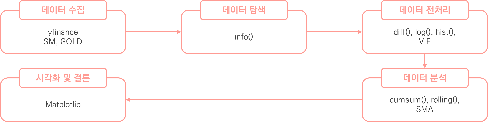
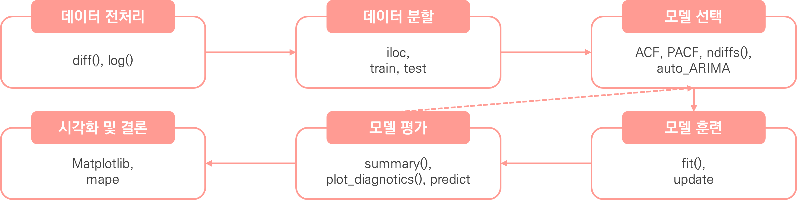
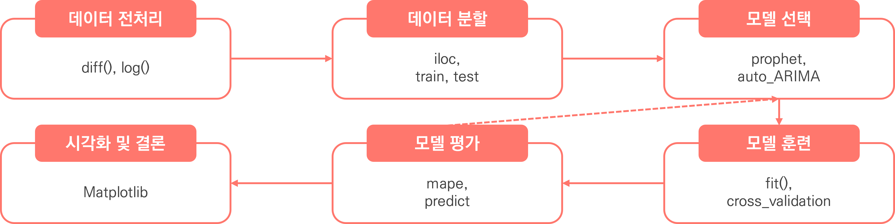
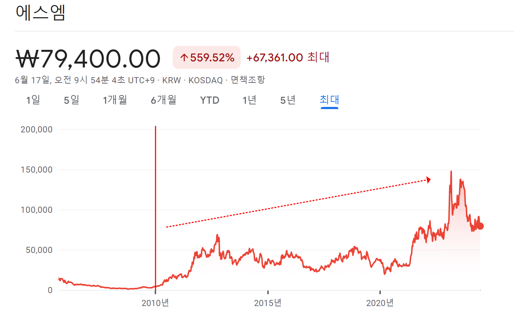
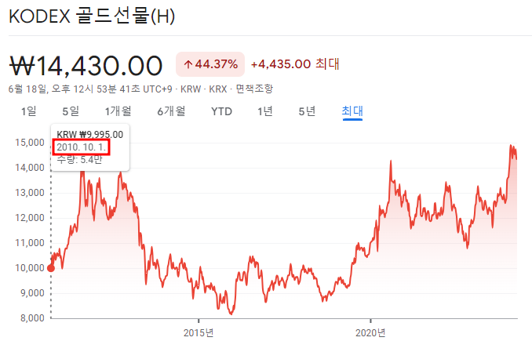
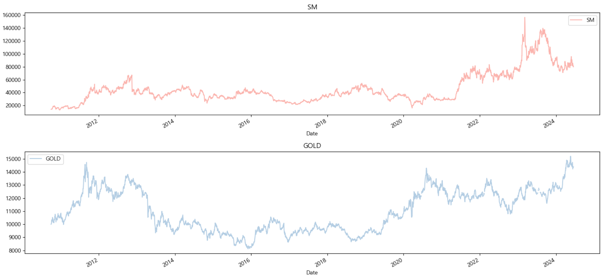
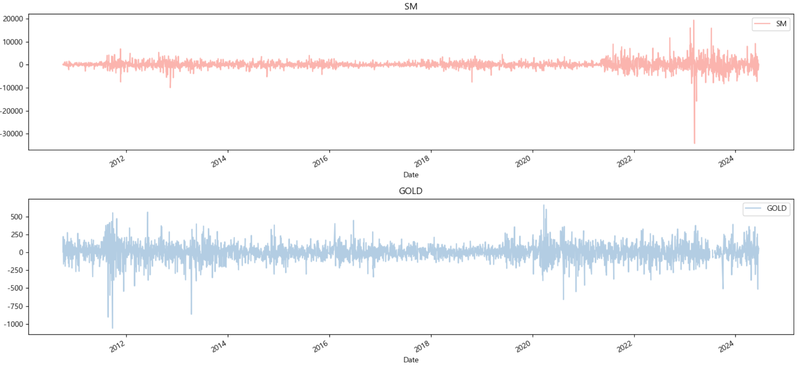
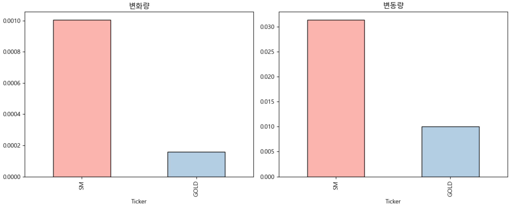
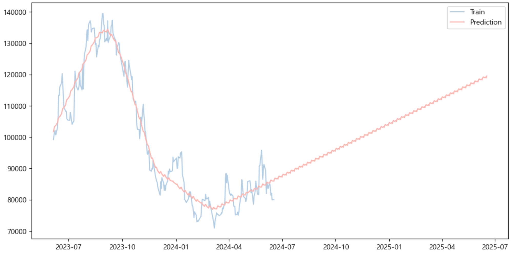

# USA Residential Building Energy Consumption Survey Regression Project
SM 엔터테인먼트 주가 예측

<br>


<br>

2024.06.17.

<br></br>
<br></br>
<br></br>
<br></br>
<br></br>

# Ⅰ. 프로젝트 개요
## 1. 프로젝트 목표
SM 엔터테인먼트 주가를 분석하여 수익 및 변동성 등의 현황을 파악하고, 최적의 모델을 통해 미래 예측 및 투자 전략을 발굴한다

<br></br>
<br></br>

## 2. 프로젝트 기대효과
✔ 미래 주가 예측
과거 데이터를 바탕으로 주가의 향후 움직임을 예측하여 투자 전략을 수립할 수 있음

<br>

✔ 투자 리스크 평가 및 관리
변동성을 분석하여 투자 리스크를 평가하고 관리할 수 있음

<br></br>
<br></br>

## 3. 데이터 흐름
### ○ 데이터 분석 프로세스

<br>

✔ 데이터 분석



<br>

✔ 머신러닝



<br>

✔ 딥러닝



<br></br>
<br></br>

## 4. 데이터 수집
✔ 데이터 정보  
Yahoo Finance의 Yfinance 라이브러리를 통한 금융 데이터 활용

<br>

✔ SM 엔터테인먼트
- 코스닥(KOSDAQ) 시장에서 거래
- SM엔터테인먼트는 대한민국의 대표적인 엔터테인먼트 기업
- 다양한 엔터테인먼트 사업을 통해 수익을 창출

<br>

✔ KODEX 골드선물(H)
- KRX (한국거래소)에서 거래
- 상장수지펀드(ETF)로 금의 가격 움직임을 추적하도록 설계
- 투자자들이 실제로 물리적인 금을 소유하지 않고도 금의 가격에 투자할 수 있는 방법을 제공

<br>

✔ 데이터 추출 (2010년 10월 1일 ~ 2024년 6월 17일)

| SM 주가                          | GOLD 주가              |
|:----------------------------:|:------------------:|
|   |   |

<details>
  <summary>code</summary>

  ```
  import yfinance as yf

  # SM 엔터테인먼트와 Gold(금 펀드, ETF) 티커를 저장
  columns = ['041510.KQ', '132030.KS']  

  # yfinance 라이브러리를 사용하여 특정 종목 데이터를 다운로드 후 시계열 데이터 프레임으로 변환 (소수점 4자리까지 표기)
  f_df = yf.download(columns, start='2010-10-01', end='2024-06-18')['Adj Close'].round(4)
  f_df
  ```
</details>

<br>

- SM의 주가는 2010년을 기점으로 큰 변동이 발생하고, GOLD 주가는 2010년 10월 1일 부터 시작하므로 해당 일자를 기준으로 현재 시점(2024년 6월 17일)까지 추출

<br></br>
<br></br>
<br></br>
<br></br>
<br></br>

# Ⅱ. 데이터 탐색 및 전처리

## 1. 데이터 탐색
### ○ info

| Column | Non-Null Count | Dtype   |
|:------:|:--------------:|:-------:|
| SM     | 3369 non-null  | float64 |
| GOLD   | 3350 non-null  | float64 |

<details>
  <summary>code</summary>

  ```
  # 데이터 정보 출력
  pre_f_df.info()
  ```
</details>

<br></br>

### ○ 주가
✔ 2010년 ~ 현재시점까지의 데이터를 보았을 때 SM과 GOLD는 2011년을 기점으로 금액이 상승하였다가 2013년 쯤 하락하였으며,  
  2020년 ~ 2021년을 기점으로 다시 금액이 상승하는 것을 볼 수 있다.  

✔ 주가 변동 패턴이 어느정도 유사하게 나타남에 따라 두 종목 간의 상관관계를 추정해볼 수 있다.


<details>
  <summary>code</summary>

  ```
  import matplotlib.pyplot as plt

  # 그래프 크기 설정
  fig, ax = plt.subplots(2, 1, figsize=(15, 7))

  # 주가 시각화
  pre_f_df.SM.plot(color=colors[0], ax=ax[0])
  ax[0].set_title('SM')
  ax[0].legend()

  pre_f_df.GOLD.plot(color=colors[1], ax=ax[1])
  ax[1].set_title('GOLD')
  ax[1].legend()

  # 레이아웃 조정
  plt.tight_layout()

  # 그래프 표시
  plt.show()
  ```
</details>

<br></br>

### ○ 차분 후 주가
✔ 차분 후 데이터를 확인하였을 때, SM, GOLD 수익률의 변동이 전반적으로 크지 않기 때문에 일반적으로 안정적이라 판단되나  
  특정연도에 수익률이 크게 변동한 것으로 나타나 안정성이 떨어진 것으로 보여진다.


<details>
  <summary>code</summary>

  ```
  import matplotlib.pyplot as plt

  # 그래프 크기 설정
  fig, ax = plt.subplots(2, 1, figsize=(15, 7))

  # 차분 후 주가 시각화
  pre_f_df.SM.diff().plot(color=colors[0], ax=ax[0])
  ax[0].set_title('SM')
  ax[0].legend()

  pre_f_df.GOLD.diff().plot(color=colors[1], ax=ax[1])
  ax[1].set_title('GOLD')
  ax[1].legend()

  # 레이아웃 조정
  plt.tight_layout()

  # 그래프 표시
  plt.show()
  ```
</details>

<br></br>

### ○ 변화량 및 변동량
✔ SM과 GOLD의 변화량 및 변동량을 비교한 결과, SM의 변화량과 변동량이 상대적으로 높게 나타났다.  
✔ 2023년 SM의 수익률 변동이 크게 발생한 점을 고려할 때, 단기적인 변동이 장기적인 안정성을 올바르게 반영하지 못할 가능성이 있다.


<details>
  <summary>code</summary>

  ```
  import matplotlib.pyplot as plt

  # 그래프 크기 설정
  fig, ax = plt.subplots(1, 2, figsize=(12, 5))

  # 변화율 시각화
  pre_f_df.pct_change().mean().plot(kind='bar', color=colors, edgecolor='black', ax=ax[0])
  ax[0].set_title('변화량')

  # 변동률 시각화
  pre_f_df.pct_change().std().plot(kind='bar', color=colors, edgecolor='black', ax=ax[1])
  ax[1].set_title('변동량')

  # 레이아웃 조정
  plt.tight_layout()

  # 그래프 표시
  plt.show()
  ```
</details>

<br></br>

### ○ 변화량 및 변동량
✔ SM과 GOLD의 변화량 및 변동량을 비교한 결과, SM의 변화량과 변동량이 상대적으로 높게 나타났다.  
✔ 2023년 SM의 수익률 변동이 크게 발생한 점을 고려할 때, 단기적인 변동이 장기적인 안정성을 올바르게 반영하지 못할 가능성이 있다.


<details>
  <summary>code</summary>

  ```
  import matplotlib.pyplot as plt

  # 그래프 크기 설정
  fig, ax = plt.subplots(1, 2, figsize=(12, 5))

  # 변화율 시각화
  pre_f_df.pct_change().mean().plot(kind='bar', color=colors, edgecolor='black', ax=ax[0])
  ax[0].set_title('변화량')

  # 변동률 시각화
  pre_f_df.pct_change().std().plot(kind='bar', color=colors, edgecolor='black', ax=ax[1])
  ax[1].set_title('변동량')

  # 레이아웃 조정
  plt.tight_layout()

  # 그래프 표시
  plt.show()
  ```
</details>


### ○ 분석
✔ 상/하위 다섯개 데이터를 확인한 결과 인덱스 외 고유의 ID 확인

✔ object 형식의 데이터 확인

✔ 결측치 확인


<br></br>
<br></br>

## 2. 전처리
### ○ 컬럼명 변경
✔ 직관적인 컬럼명으로 변경

<details>
  <summary>code</summary>

  ```
  # 컬럼을 명확하게 확인할 수 있도록 컬럼명 변경
  pre_f_df = f_df.rename(columns={'041510.KQ': 'SM', '132030.KS': 'GOLD'})
  pre_f_df
  ```
</details>

<br></br>

### ○ null 데이터
✔ null 값은 존재하지 않는 것으로 확인

<details>
  <summary>code</summary>

  ```
  # null 값 확인
  pre_r_df.isnull().sum().sum()
  ```
</details>

<br></br>

### ○ 중복행
✔ 중복행은 존재하지 않는 것으로 확인

<details>
  <summary>code</summary>

  ```
  # 중복행 확인
  pre_r_df.duplicated().sum()
  ```
</details>

<br></br>

### ○ 컬럼 제거
✔ 불필요한 ID 컬럼 제거 (DOEID)

<details>
  <summary>code</summary>

  ```
  # 불필요한 컬럼 제거
  pre_r_df = pre_r_df.drop(labels='DOEID', axis=1)
  ```
</details>

<br></br>

### ○ LabelEncoder
✔ 데이터 정보 확인 결과 object 형식의 4개 열이 확인됨  
✔ LabelEncoder를 통해 정수로 변환함

<details>
  <summary>oject 확인 code</summary>

  ```
  # 오브젝트 형태를 띄는 열 찾기
  object_columns = pre_r_df.select_dtypes(include=['object']).columns
  object_columns
  ```
</details>
<details>
  <summary>컬럼 고유 값 확인 code</summary>

  ```
  # object 컬럼의 고유 값 확인
  columns = ['METROMICRO', 'UATYP10', 'CLIMATE_REGION_PUB', 'IECC_CLIMATE_PUB']

  for column in columns:
      print(pre_r_df[column].unique())
  ```
</details>
<details>
  <summary>LabelEncoder code</summary>

  ```
  from sklearn.preprocessing import LabelEncoder

  # 데이터 프레임 복제
  enc_r_df = pre_r_df.copy()
  encoders = {}

  # 문자열 컬럼 추출
  columns = columns = ['METROMICRO', 'UATYP10', 'CLIMATE_REGION_PUB', 'IECC_CLIMATE_PUB']

  # 반복하여 컬럼 인코딩 처리:
  for column in columns:
      # 레이블인코더 객체 생성
      encoder = LabelEncoder()
      # 문자열 데이터 정수로 형변환
      result = encoder.fit_transform(enc_r_df[column])
      # 형변환 값으로 대체
      enc_r_df[column] = result
      # 원본 데이터 담기
      encoders[column] = encoder.classes_

  encoders
  ```
</details>

<br></br>
<br></br>
<br></br>
<br></br>
<br></br>

# Ⅲ 머신러닝
## 1. 평가 지표
<table>
  <tr>
      <td>연번</td>
      <td> 평가지표</td>
      <td>산출 코드</td>
  </tr>
  <tr>
      <td>1</td>
      <td>MSE</td>
      <td>mean_squared_error(y_test, prediction)</td>
  </tr>
  <tr>
      <td>2</td>
      <td>RMSE</td>
      <td>np.sqrt(MSE)</td>
  </tr>
  <tr>
      <td>3</td>
      <td>R2</td>
      <td>r2_score(y_test, prediction)</td>
  </tr>
</table>

<details>
  <summary>code</summary>

  ```
  import numpy as np
  from sklearn.metrics import mean_squared_log_error, mean_squared_error, r2_score

  def get_evaluation(y_test, prediction):
      MSE = mean_squared_error(y_test, prediction)
      RMSE = np.sqrt(MSE)
      R2 = r2_score(y_test, prediction)
      print('MSE: {:.4f}, RMSE: {:.4f}, R2: {:.4f}'\
          .format(MSE, RMSE, R2))
  ```
</details>

<br></br>
<br></br>

## 2. 1Cycle
### ○ 훈련



<details>
  <summary>code</summary>

  ```
  import numpy as np
  from sklearn.linear_model import LinearRegression
  from sklearn.model_selection import train_test_split

  # 데이터 세트 분리
  # 피처, 타겟 데이터 분리
  features, targets = enc_r_df.iloc[:, :-1], enc_r_df.iloc[:, -1]

  # 학습/테스트 및 문제/정답 데이터 세트 분리
  X_train, X_test, y_train, y_test = \
  train_test_split(features, targets, test_size=0.2, random_state=124)

  # 선형 회귀 모델
  l_r = LinearRegression()
  # 훈련
  l_r.fit(X_train, y_train)
  ```
</details>

<br></br>

### ○ 예측 및 평가  
MSE: 0.0267, RMSE: 0.1635, R2: 1.0000
<details>
  <summary>code</summary>

  ```
  # 예측
  prediction = l_r.predict(X_test)
  # 평가
  get_evaluation(y_test, prediction)
  ```
</details>

<br></br>

### ○ 분석
✔ LinearRegression을 통한 학습 결과 R2 점수가 1.0로 보이고 있음

✔ 추가적인 전처리 과정을 통해 수치를 조정해보려 함

<br></br>
<br></br>

## 3. 2Cycle
### ○ 이상치 제거
✔ StandardScaler를 통해 데이터 변환 후 이상치 제거

<details>
  <summary>code</summary>

  ```
  # 타겟 데이터 이상치 제거
  from sklearn.preprocessing import StandardScaler

  dro_r_df = enc_r_df.copy()

  # 표준화 객체 생성
  std = StandardScaler()
  # 데이터 표준화 변환
  result = std.fit_transform(dro_r_df)
  # 표준화 데이터 프레임 생성
  std_r_df = pd.DataFrame(result, columns=dro_r_df.columns)

  for column in std_r_df.columns:
      # 타겟 데이터 이상치 제거
      copy_std_r_df = std_r_df[std_r_df[column].between(-1.96, 1.96)]

  # 이상치 제거후 유지되는 인덱스를 대조하여 원본 데이터 이상치 제거
  dro_r_df = dro_r_df.iloc[copy_std_r_df.index].reset_index(drop=True)
  dro_r_df
  ```
</details>

<br></br>

### ○ 종속 변수 분포
✔ 이상치 제거 후 종속 변수 분포 확인


<details>
  <summary>code</summary>

  ```
  # 타겟 컬럼 분포 확인
  dro_r_df.target.hist(color=cmap(np.array([1])), edgecolor='black')
  ```
</details>

<br></br>

### ○ 훈련


<details>
  <summary>code</summary>

  ```
  import numpy as np
  from sklearn.linear_model import LinearRegression
  from sklearn.model_selection import train_test_split

  # 데이터 세트 분리
  # 피처, 타겟 데이터 분리
  features, targets = dro_r_df.iloc[:, :-1], dro_r_df.iloc[:, -1]

  # 학습/테스트 및 문제/정답 데이터 세트 분리
  X_train, X_test, y_train, y_test = \
  train_test_split(features, targets, test_size=0.2, random_state=124)

  # 선형 회귀 모델
  l_r = LinearRegression()
  # 훈련
  l_r.fit(X_train, y_train)
  ```
</details>


<br></br>

### ○ 예측 및 평가  
MSE: 0.0001, RMSE: 0.0076, R2: 1.0000
<details>
  <summary>code</summary>

  ```
  # 예측
  prediction = l_r.predict(X_test)
  # 평가
  get_evaluation(y_test, prediction)
  ```
</details>

<br></br>

### ○ 분석
✔  이상치 제거 후에도 R2 점수가 동일하게 1.0으로 나타남  

✔  이상치 제거 후 종속 변수의 분포가 정규분포 모양에 가까워짐에 따라 이상치를 제거하여 진행

<br></br>
<br></br>

## 4. 3Cycle
### ○ 차원축소


<br>

✔ 차원축소 후 보존율이 약 0.5964으로 나옴에 따라 차원 축소 후에도 데이터 상당 부분이 유지됨을 알 수 있음

✔ 몇몇 데이터가 다른 데이터와 떨어져있지만, 전반적으로 고르게 분포되어 있음

<details>
  <summary>데이터 분리 code</summary>

  ```
  import numpy as np
  from sklearn.linear_model import LinearRegression
  from sklearn.model_selection import train_test_split

  # 데이터 세트 분리
  # 피처, 타겟 데이터 분리
  features, targets = dro_r_df.iloc[:, :-1], dro_r_df.iloc[:, -1]

  # 학습/테스트 및 문제/정답 데이터 세트 분리
  X_train, X_test, y_train, y_test = \
  train_test_split(features, targets, test_size=0.2, random_state=124)

  # 학습 및 테스트 데이터로 병합
  train_df = pd.concat([X_train, y_train], axis=1).reset_index(drop=True)
  test_df = pd.concat([X_test, y_test], axis=1).reset_index(drop=True)
  ```
</details>
<details>
  <summary>차원축소 code</summary>

  ```
  from sklearn.decomposition import PCA

  # 차원 축소 객체 생성
  # n_components: 얼마나 차원축소할 건지 작성
  pca = PCA(n_components=5)

  # 타겟을 제외하고 피처만 차원 축소
  pca_train = pca.fit_transform(train_df.iloc[:, :-1])
  pca_test = pca.fit_transform(test_df.iloc[:, :-1])

  # 크기 확인
  print(pca_train.shape, pca_test.shape)
  ```
</details>
<details>
  <summary>데이터 프레임 생성 code</summary>

  ```
  # train
  # 컬럼명 설정
  pca_columns = [f'pca{i + 1}' for i in range(pca_train.shape[1])]

  # 차원 축소 데이터 프레임 생성
  pca_train_df = pd.DataFrame(pca_train, columns=pca_columns)
  # 타겟 데이터 추가
  pca_train_df.loc[:, 'target'] = train_df['target']

  # test
  # 컬럼명 설정
  pca_columns = [f'pca{i + 1}' for i in range(pca_test.shape[1])]

  # 차원 축소 데이터 프레임 생성
  pca_test_df = pd.DataFrame(pca_test, columns=pca_columns)
  # 타겟 데이터 추가
  pca_test_df.loc[:, 'target'] = test_df['target']
  ```
</details>
<details>
  <summary>보존율 확인 code</summary>

  ```
  # 보존율 확인
  # 각각의 피처가 얼만큼 설명하고 있는지
  print(pca.explained_variance_ratio_)
  print(pca.explained_variance_ratio_.sum())
  ```
</details>

<br></br>

### ○ 선형 회귀


<details>
  <summary>code</summary>

  ```
  from sklearn.preprocessing import StandardScaler
  from sklearn.pipeline import Pipeline
  from sklearn.model_selection import train_test_split
  from sklearn.linear_model import LinearRegression
  from sklearn.decomposition import PCA

  # 데이터 세트 분리
  # 피처, 타겟 데이터 분리
  features, targets = dro_r_df.iloc[:, :-1], dro_r_df.iloc[:, -1]

  # 학습/테스트 및 문제/정답 데이터 세트 분리
  X_train, X_test, y_train, y_test = \
  train_test_split(features, targets, test_size=0.2, random_state=124)

  # 선형 회귀 모델 객체 생성
  l_r = LinearRegression()

  # 파이프 라인 구축
  pipe = Pipeline([('pca', PCA(n_components=5)), ('l_r', l_r)])

  # 훈련
  pipe.fit(X_train, y_train)
  ```
</details>


<br></br>

### ○ 선형 회귀 - 예측 및 평가  
MSE: 140353.8722, RMSE: 374.6383, R2: 0.7456

<details>
  <summary>code</summary>

  ```
  # 예측
  prediction = pipe.predict(X_test)

  # 평가
  get_evaluation(y_test, prediction)
  ```
</details>

<br></br>

### ○ 선형 회귀 + StandardScaler


<details>
  <summary>code</summary>

  ```
  from sklearn.preprocessing import StandardScaler
  from sklearn.pipeline import Pipeline
  from sklearn.model_selection import train_test_split
  from sklearn.linear_model import LinearRegression
  from sklearn.decomposition import PCA

  # 데이터 세트 분리
  # 피처, 타겟 데이터 분리
  features, targets = dro_r_df.iloc[:, :-1], dro_r_df.iloc[:, -1]

  # 학습/테스트 및 문제/정답 데이터 세트 분리
  X_train, X_test, y_train, y_test = \
  train_test_split(features, targets, test_size=0.2, random_state=124)

  # 선형 회귀 모델 객체 생성
  l_r = LinearRegression()

  # 파이프 라인 구축
  pipe = Pipeline([('std', StandardScaler()), ('pca', PCA(n_components=5)), ('l_r', l_r)])

  # 훈련
  pipe.fit(X_train, y_train)
  ```
</details>


<br></br>

### ○ 선형 회귀 + StandardScaler - 예측 및 평가  
MSE: 267042.6324, RMSE: 516.7617, R2: 0.5159

<details>
  <summary>code</summary>

  ```
  # 예측
  prediction = pipe.predict(X_test)

  # 평가
  get_evaluation(y_test, prediction)
  ```
</details>

<br></br>

### ○ 다중 회귀


<details>
  <summary>code</summary>

  ```
  from sklearn.preprocessing import StandardScaler
  from sklearn.pipeline import Pipeline
  from sklearn.model_selection import train_test_split
  from sklearn.linear_model import LinearRegression
  from sklearn.decomposition import PCA
  from sklearn.preprocessing import PolynomialFeatures

  # 데이터 세트 분리
  # 피처, 타겟 데이터 분리
  features, targets = dro_r_df.iloc[:, :-1], dro_r_df.iloc[:, -1]

  # 차수 확장
  poly_features = PolynomialFeatures(degree=2).fit_transform(features)

  # 학습/테스트 및 문제/정답 데이터 세트 분리
  X_train, X_test, y_train, y_test = \
  train_test_split(features, targets, test_size=0.2, random_state=124)

  # 선형 회귀 모델 객체 생성
  l_r = LinearRegression()

  # 파이프 라인 구축
  pipe = Pipeline([('pca', PCA(n_components=5)), ('l_r', l_r)])

  # 훈련
  pipe.fit(X_train, y_train)
  ```
</details>


<br></br>

### ○ 다중 회귀 - 예측 및 평가  
MSE: 140378.4248, RMSE: 374.6711, R2: 0.7455

<details>
  <summary>code</summary>

  ```
  # 예측
  prediction = pipe.predict(X_test)
  # 평가
  get_evaluation(y_test, prediction)
  ```
</details>

<br></br>

### ○ 회귀 모델 - 훈련, 예측 및 평가
DecisionTreeRegressor  
MSE: 264713.3422, RMSE: 514.5030, R2: 0.5201

<br>

RandomForestRegressor  
MSE: 131728.1830, RMSE: 362.9438, R2: 0.7612

<br>

GradientBoostingRegressor  
MSE: 126602.3576, RMSE: 355.8123, R2: 0.7705

<br>

XGBRegressor  
MSE: 139819.1225, RMSE: 373.9240, R2: 0.7465

<br>

LGBMRegressor  
MSE: 129706.5225, RMSE: 360.1479, R2: 0.7649

<details>
  <summary>code</summary>

  ```
  from sklearn.tree import DecisionTreeRegressor
  from sklearn.ensemble import RandomForestRegressor
  from sklearn.ensemble import GradientBoostingRegressor
  from xgboost import XGBRegressor
  from lightgbm import LGBMRegressor
  from sklearn.decomposition import PCA
  from sklearn.model_selection import train_test_split

  # 데이터 세트 분리
  # 피처, 타겟 데이터 분리
  features, targets = dro_r_df.iloc[:, :-1], dro_r_df.iloc[:, -1]

  # 학습/테스트 및 문제/정답 데이터 세트 분리
  X_train, X_test, y_train, y_test = \
  train_test_split(features, targets, test_size=0.2, random_state=124)

  # 회귀 모델 담기
  dt_r = DecisionTreeRegressor(random_state=124)
  rf_r = RandomForestRegressor(random_state=124, n_estimators=1000)
  gb_r = GradientBoostingRegressor(random_state=124)
  xgb_r = XGBRegressor(random_state=124)
  lgb_r = LGBMRegressor(random_state=124)

  models = [dt_r, rf_r, gb_r, xgb_r, lgb_r]

  # 모델 별 학습 진행:
  for model in models:
      # 파이프 라인 구축
      pipe = Pipeline([('pca', PCA(n_components=5)), (f'{model}', model)])
      # 모델 학습
      pipe.fit(X_train, y_train)
      # 예측
      prediction = pipe.predict(X_test)
      # 모델명 출력 (모델명과 평가 결과가 같이 출력되도록)
      print(model.__class__.__name__)
      # 평가
      get_evaluation(y_test, prediction)
  ```
</details>

<br></br>

### ○ 분석


| model            | model   |
|:----------------:|:-------:|
| Linear           | 0.7456  |
| Linear+std       | 0.5159  |
| Polynomial       | 0.7455  |
| DecisionTree     | 0.5201  |
| RandomForest     | 0.7612  |
| GradientBoosting | 0.7705  |
| XGB              | 0.7465  |
| LGBM             | 0.7649  |

<br></br>

✔ 선형 회귀 모델이 가장 성능이 높고, 다중 회귀 시 오히려 성능이 저하됨에 따라 선형 패턴을 지니고 있다고 판단되나  
  회귀 모델 분석 시 R2 점수가 0.77로 상승함에 따라 완전한 선형은 아니고 비선형의 패턴도 띄고 있음을 확인함  

✔ StandardScaler 시 오히려 성능이 저하되므로 사용하지 않기로함

✔ 회귀 모델 중 GradientBoostingRegressor을 사용하였을 때, 가장 좋은 성능을 보임에 따라 해당 모델을 선택하는 것이 적합하다고 판단됨

<br></br>
<br></br>

## 5. 4Cycle
### ○ GridSearchCV


<details>
  <summary>code</summary>

  ```
  from sklearn.model_selection import train_test_split
  from sklearn.ensemble import GradientBoostingRegressor
  from sklearn.model_selection import GridSearchCV
  from sklearn.model_selection import KFold
  from sklearn.decomposition import PCA

  # 데이터 세트 분리
  # 피처, 타겟 데이터 분리
  features, targets = dro_r_df.iloc[:, :-1], dro_r_df.iloc[:, -1]

  # 문제/정답 및 학습/훈련 데이터 분리
  X_train, X_test, y_train, y_test = \
  train_test_split(features, targets, test_size=0.2, random_state=124)

  # 검증 데이터 분리
  val_X_train, val_X_test, val_y_train, val_y_test = \
  train_test_split(X_train, y_train, test_size=0.2, random_state=124)

  # 가장 성능이 우수한 모델 담기
  kf_gb_r = GradientBoostingRegressor(random_state=124)

  # 파라미터 값 조정
  parameters = {'kf_gb_r__max_depth': [6, 7, 8], 'kf_gb_r__min_samples_split': [60, 70, 80], 'kf_gb_r__n_estimators': [60, 70, 80]}

  # 교차검증
  # n_splits: 데이터를 몇 개의 폴드로 나눌지를 결정 (일반적으로 5 또는 10)
  # shuffle: 분할 전 데이터 혼합 여부 
  kfold = KFold(n_splits=5, random_state=124, shuffle=True)

  pipe = Pipeline([('pca', PCA(n_components=5)), ('kf_gb_r', kf_gb_r)])

  # 학습 및 교차 검증 모델 설정
  grid_kf_gb_r = GridSearchCV(pipe, param_grid=parameters, cv=kfold, n_jobs=-1)

  # 훈련
  grid_kf_gb_r.fit(X_train, y_train)
  ```
</details>

<br></br>

### ○ 최적의 파라미터

| modelmax_depth | min_samples_split | n_estimators |
|:--------------:|:-----------------:|:------------:|
| 6              | 80                | 60           |

<details>
  <summary>code</summary>

  ```
  # 훈련 결과 확인
  result_df = pd.DataFrame(grid_kf_gb_r.cv_results_)[['params', 'mean_test_score', 'rank_test_score']]
  display(result_df)
  ```
</details>

<br></br>

### ○ 예측 및 평가  
MSE: 129113.8568, RMSE: 359.3242, R2: 0.7659

<details>
  <summary>code</summary>

  ```
  # 최적의 모델 담기
  kf_gb_r = grid_kf_gb_r.best_estimator_

  # 예측
  prediction = kf_gb_r.predict(X_test)
  # 평가
  get_evaluation(y_test, prediction)
  ```
</details>

<br></br>

### ○ 분석
✔ 최적의 하이퍼파라미터 값을 찾아 훈련한 결과 성능이 향상된 것을 확인함

<br></br>

### ○ cross val score
[0.80879301, 0.7774111 , 0.79371269, 0.74300814, 0.7702855 ]

<details>
  <summary>code</summary>

  ```
  from sklearn.model_selection import cross_val_score

  # 점수 확인
  score = cross_val_score(kf_gb_r, features, targets)
  score
  ```
</details>

<br></br>

### ○ 과적합 확인


<br>

train  
MSE: 67414.6030, RMSE: 259.6432, R2: 0.8795  

<br>

validation  
MSE: 65419.9304, RMSE: 255.7732, R2: 0.8830  

<br>

test  
MSE: 129113.8568, RMSE: 359.3242, R2: 0.7659  


<details>
  <summary>code</summary>

  ```
  import matplotlib.pyplot as plt

  fig, ax = plt.subplots(1, 3, figsize=(14, 5))

  # 예측
  prediction = kf_gb_r.predict(X_train)
  # 평가
  get_evaluation(y_train, prediction)

  ax[0].scatter(y_train, prediction, edgecolors='red', c='orange', alpha=0.2)
  ax[0].plot([y_train.min(), y_train.max()], [y_train.min(), y_train.max()], 'k--')
  ax[0].set_title('train')

  # 예측
  prediction = kf_gb_r.predict(val_X_train)
  # 평가
  get_evaluation(val_y_train, prediction)

  ax[1].scatter(val_y_train, prediction, edgecolors='red', c='orange', alpha=0.2)
  ax[1].plot([val_y_train.min(), val_y_train.max()], [val_y_train.min(), val_y_train.max()], 'k--')
  ax[1].set_title('Validation')

  # 예측
  prediction = kf_gb_r.predict(X_test)
  # 평가
  get_evaluation(y_test, prediction)

  ax[2].scatter(y_test, prediction, edgecolors='red', c='orange', alpha=0.2)
  ax[2].plot([y_test.min(), y_test.max()], [y_test.min(), y_test.max()], 'k--')
  ax[2].set_title('test')

  plt.show()
  ```
</details>

<br></br>

### ○ 분석
✔ 훈련 데이터 보다 테스트 데이터의 성능이 더 저하됨에 따라 과적합이 발생했다고 판단함

✔ 파라미터 조정을 통해 과적합을 해소하고자 함

<br></br>
<br></br>

## 6. 5Cycle
### ○ 파라미터 조정 - 과적합 해소


<details>
  <summary>code</summary>

  ```
  from sklearn.model_selection import train_test_split
  from sklearn.ensemble import GradientBoostingRegressor
  from sklearn.model_selection import GridSearchCV
  from sklearn.model_selection import KFold
  from sklearn.decomposition import PCA

  # 데이터 세트 분리
  # 피처, 타겟 데이터 분리
  features, targets = dro_r_df.iloc[:, :-1], dro_r_df.iloc[:, -1]

  # 문제/정답 및 학습/훈련 데이터 분리
  X_train, X_test, y_train, y_test = \
  train_test_split(features, targets, test_size=0.2, random_state=124)

  # 검증 데이터 분리
  val_X_train, val_X_test, val_y_train, val_y_test = \
  train_test_split(X_train, y_train, test_size=0.2, random_state=124)

  # 가장 성능이 우수한 모델 담기
  kf_gb_r = GradientBoostingRegressor(random_state=124)

  # 파라미터 값 조정
  parameters = {'kf_gb_r__max_depth': [4, 5], 'kf_gb_r__min_samples_split': [69, 70, 71], 'kf_gb_r__n_estimators': [68, 69, 70]}

  # 교차검증
  # n_splits: 데이터를 몇 개의 폴드로 나눌지를 결정 (일반적으로 5 또는 10)
  # shuffle: 분할 전 데이터 혼합 여부 
  kfold = KFold(n_splits=5, random_state=124, shuffle=True)

  pipe = Pipeline([('pca', PCA(n_components=5)), ('kf_gb_r', kf_gb_r)])

  # 학습 및 교차 검증 모델 설정
  grid_kf_gb_r = GridSearchCV(pipe, param_grid=parameters, cv=kfold, n_jobs=-1)

  # 훈련
  grid_kf_gb_r.fit(X_train, y_train)
  ```
</details>

<br></br>

### ○ 최적의 파라미터

| modelmax_depth | min_samples_split | n_estimators |
|:--------------:|:-----------------:|:------------:|
| 4              | 71                | 70           |

<details>
  <summary>code</summary>

  ```
  # 훈련 결과 확인
  result_df = pd.DataFrame(grid_kf_gb_r.cv_results_)[['params', 'mean_test_score', 'rank_test_score']]
  display(result_df)
  ```
</details>

<br></br>

### ○ 예측 및 평가  
MSE: 126075.4075, RMSE: 355.0710, R2: 0.7714

<details>
  <summary>code</summary>

  ```
  # 최적의 모델 담기
  kf_gb_r = grid_kf_gb_r.best_estimator_

  # 예측
  prediction = kf_gb_r.predict(X_test)
  # 평가
  get_evaluation(y_test, prediction)
  ```
</details>

<br></br>

### ○ cross val score
[0.80198148, 0.7827625 , 0.79563508, 0.74960281, 0.77784566]

<details>
  <summary>code</summary>

  ```
  from sklearn.model_selection import cross_val_score

  # 점수 확인
  score = cross_val_score(kf_gb_r, features, targets)
  score
  ```
</details>

<br></br>

### ○ 과적합 확인


<br>

train  
MSE: 86694.7603, RMSE: 294.4397, R2: 0.8450

<br>

validation  
MSE: 83796.1877, RMSE: 289.4757, R2: 0.8501  

<br>

test  
MSE: 126075.4075, RMSE: 355.0710, R2: 0.7714  


<details>
  <summary>code</summary>

  ```
  import matplotlib.pyplot as plt

  fig, ax = plt.subplots(1, 3, figsize=(14, 5))

  # 예측
  prediction = kf_gb_r.predict(X_train)
  # 평가
  get_evaluation(y_train, prediction)

  ax[0].scatter(y_train, prediction, edgecolors='red', c='orange', alpha=0.2)
  ax[0].plot([y_train.min(), y_train.max()], [y_train.min(), y_train.max()], 'k--')
  ax[0].set_title('train')

  # 예측
  prediction = kf_gb_r.predict(val_X_train)
  # 평가
  get_evaluation(val_y_train, prediction)

  ax[1].scatter(val_y_train, prediction, edgecolors='red', c='orange', alpha=0.2)
  ax[1].plot([val_y_train.min(), val_y_train.max()], [val_y_train.min(), val_y_train.max()], 'k--')
  ax[1].set_title('Validation')

  # 예측
  prediction = kf_gb_r.predict(X_test)
  # 평가
  get_evaluation(y_test, prediction)

  ax[2].scatter(y_test, prediction, edgecolors='red', c='orange', alpha=0.2)
  ax[2].plot([y_test.min(), y_test.max()], [y_test.min(), y_test.max()], 'k--')
  ax[2].set_title('test')

  plt.show()
  ```
</details>

<br></br>

### ○ 분석
✔ 파라미터 조정 결과 테스트 데이터의 성능은 상향되고 훈련 데이터의 성능이 많이 저하된 것으로 보아 어느정도 과적합이 해소됐다고 판단함

<br></br>
<br></br>
<br></br>
<br></br>
<br></br>

# Ⅳ 결론
✔ 과적합이 해소되고 성능이 가장 우세한 것으로 나타나는 5Cycle 모델을 채택함