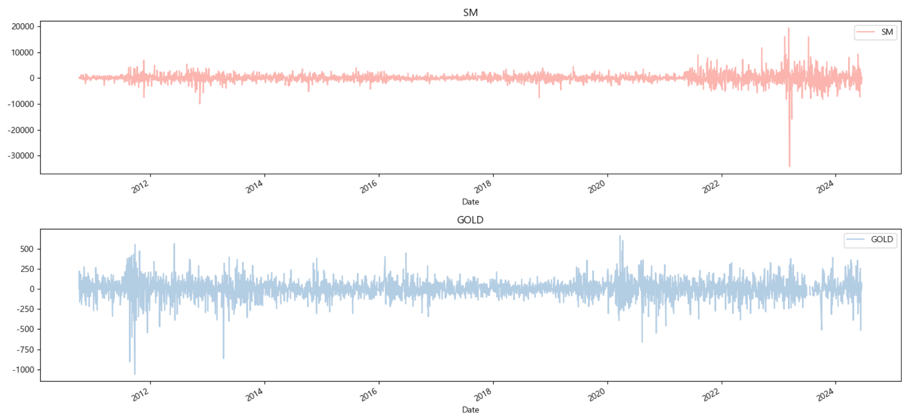
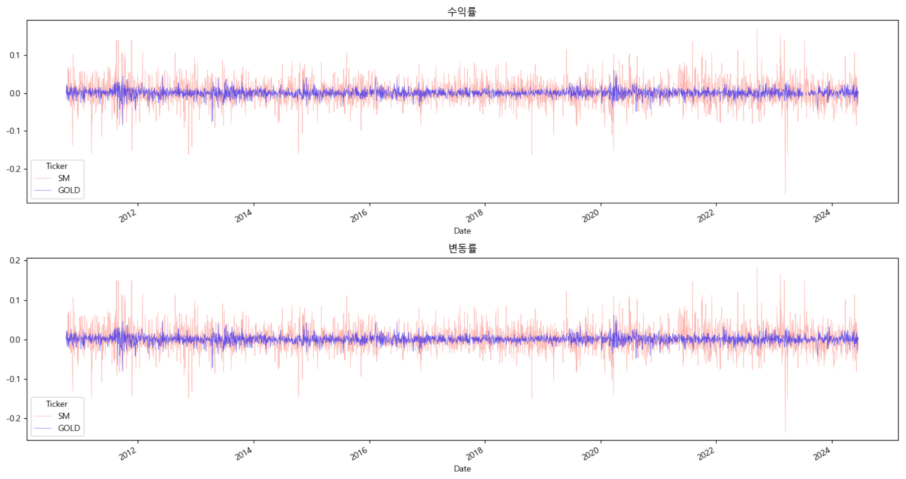

# SM 엔터테인먼트 주가 예측
- 2024년 6월 17일 기준으로 작성

<br></br>


## ○ SM엔터테인먼트
- 코스닥(KOSDAQ) 시장에서 거래된다.
- SM엔터테인먼트는 대한민국의 대표적인 엔터테인먼트 기업으로, 가수, 배우 등의 매니지먼트와 음악, 드라마, 영화 등의 콘텐츠 제작을 주로 한다.
- 이 회사는 다양한 아티스트의 매니지먼트 및 트레이닝을 통해 대중문화 산업을 선도하며, 글로벌 시장에서도 활발히 활동하고 있다.
- SM엔터테인먼트는 NCT, Red Velvet, aespa 등 다수의 인기 아이돌 그룹을 보유하고 있으며, 다양한 엔터테인먼트 사업을 통해 수익을 창출한다.  
<sub>*코스닥(KOSDAQ): 대한민국의 중소기업과 벤처기업을 위한 주식 시장</sub>

<br></br>

## ○ KODEX 골드선물(H)
- KRX (한국거래소)에서 거래된다.
- 상장수지펀드(ETF)로 금의 가격 움직임을 추적하도록 설계되어있다.
- 이 펀드는 투자자들이 실제로 물리적인 금을 소유하지 않고도 금의 가격에 투자할 수 있는 방법을 제공한다.
- 'H'는 환율 변동에 따른 리스크를 줄이기 위한 환 헤지 전략이 적용되었음을 나타낸다.   
<sub>*상장지수펀드(ETF, Exchange-Traded Fund): 주식 시장에서 거래되는 투자 펀드</sub>

<br></br>
<br></br>
<br></br>

## Ⅰ. 데이터 분석
### 1. 데이터 불러오기

<div>
    
    
</div>

<br>

<div>
    
    
</div>

<br>

| Date       | SM         | GLD     |
|:----------:|:----------:|:-------:|
| 2010-01-04 | 4196.3833  | 109.80  |
| 2010-01-05 | 4408.4121  | 109.70  |
| ...        | ...        | ...     |
| 2024-06-14 | 79900.0000 | 215.73  |
| 2024-06-17 | 80000.0000 | 214.63  |

<details>
  <summary>code</summary>

  ```
  import yfinance as yf

  # SM 엔터테인먼트와 Gold(금 펀드, ETF) 티커를 저장
  columns = ['041510.KQ', '132030.KS']  

  # yfinance 라이브러리를 사용하여 특정 종목 데이터를 다운로드 후 시계열 데이터 프레임으로 변환 (소수점 4자리까지 표기)
  f_df = yf.download(columns, start='2010-10-01', end='2024-06-18')['Adj Close'].round(4)
  f_df
  ```
</details>

<br>

- 그룹 소녀시대의 상승세에 따라 2010년을 기점으로 큰 변동이 발생하기 때문에, 우선 2010년을 기준으로 잡는다.
- GOLD 주가가 2010년 10월 1일 부터 시작하기 때문에 2010년 10월 1일을 기준으로 데이터를 추출한다.

<br></br>
<br></br>

### 2. 주가
#### ○ 주가 비교


<details>
  <summary>code</summary>

  ```
  import matplotlib.pyplot as plt

  # 그래프 크기 설정
  fig, ax = plt.subplots(2, 1, figsize=(15, 7))

  # 주가 시각화
  pre_f_df.SM.plot(color=colors[0], ax=ax[0])
  ax[0].set_title('SM')
  ax[0].legend()

  pre_f_df.GOLD.plot(color=colors[1], ax=ax[1])
  ax[1].set_title('GOLD')
  ax[1].legend()

  # 레이아웃 조정
  plt.tight_layout()

  # 그래프 표시
  plt.show()
  ```
</details>

<br>

- 2010년 ~ 현재시점까지의 데이터를 보았을 때 SM과 GLD은 2011년을 기점으로 금액이 상승하였다가 2013년 쯤 하락하였으며,  
  2020년 ~ 2021년을 기점으로 다시 금액이 상승하는 것을 볼 수 있다.
- 주가 변동 패턴이 어느정도 유사하게 나타남에 따라 두 종목 간의 상관관계를 추정해볼 수 있다.

<br></br>

#### ○ 차분 후 주가 비교


<details>
  <summary>code</summary>

  ```
import matplotlib.pyplot as plt

  # 그래프 크기 설정
  fig, ax = plt.subplots(2, 1, figsize=(15, 7))

  # 차분 후 주가 시각화
  pre_f_df.SM.diff().plot(color=colors[0], ax=ax[0])
  ax[0].set_title('SM')
  ax[0].legend()

  pre_f_df.GOLD.diff().plot(color=colors[1], ax=ax[1])
  ax[1].set_title('GOLD')
  ax[1].legend()

  # 레이아웃 조정
  plt.tight_layout()

  # 그래프 표시
  plt.show()
  ```
</details>

<br>

- 차분 후 데이터를 확인하였을 때, SM, GLD 수익률의 변동이 전반적으로 크지 않기 때문에 일반적으로 안정적이라 판단되나  
  2023년 sm의 수익률이 크게 변동한 것으로 나타나 해당 연도에 안정성이 떨어진 것으로 보여진다.

<br></br>
<br></br>

### 3. 변화율 및 변동률


<details>
  <summary>code</summary>

  ```
  import matplotlib.pyplot as plt

  # 그래프 크기 설정
  fig, ax = plt.subplots(1, 2, figsize=(12, 5))

  # 변화율 시각화
  pre_f_df.pct_change().mean().plot(kind='bar', color=colors, edgecolor='black', ax=ax[0])
  ax[0].set_title('변화량')

  # 변동률 시각화
  pre_f_df.pct_change().std().plot(kind='bar', color=colors, edgecolor='black', ax=ax[1])
  ax[1].set_title('변동량')

  # 레이아웃 조정
  plt.tight_layout()

  # 그래프 표시
  plt.show()
  ```
</details>

<br>

- SM과 GOLD의 변화량 및 변동량을 비교한 결과, SM의 변화량과 변동량이 상대적으로 높게 나타났다.
- 2023년 SM의 수익률 변동이 크게 발생한 점을 고려할 때, 단기적인 변동이 장기적인 안정성을 올바르게 반영하지 못할 가능성이 있다.

<br></br>
<br></br>

### 4. 수익률


<br>

| 종목  | 수익률       |
|:---:|:---------:|
| SM  | 0.259264  |
| GLD | 0.047449  |

<details>
  <summary>code</summary>

  ```
  import matplotlib.pyplot as plt

  # 그래프 크기 설정
  fig, ax = plt.subplots(2, 1, figsize=(15, 8))

  # 특정 데이터 수익률 시각화
  # lw = line widht = 선 두께
  rate_f_df[['SM', 'GLD']].plot(color=colors, lw=0.5, ax=ax[0])
  ax[0].set_title('수익률')

  # 특정 데이터 수익률 시각화
  # lw = line widht = 선 두께
  pct_f_df[['SM', 'GLD']].plot(color=colors, lw=0.5, ax=ax[1])
  ax[1].set_title('변동률')

  # 레이아웃 조정
  plt.tight_layout()

  # 그래프 표시
  plt.show()
  ```
</details>

<br>

- 현재 시점에서 과거의 시점을 기준으로 SM과 GOLD의 수익률을 계산하고 시각화했다.
- SM의 수익률이 더 큰 것을 확인할 수 있었지만, 변동률은 GOLD가 더 안정적으로 나타났다.
- 고수익을 원하는 투자자는 SM을 선호할 수 있지만, 안정적인 투자를 원하는 경우에는 GLD를 선택할 수 있다.

<br></br>

#### ○ 일간 수익률


<details>
  <summary>code</summary>

  ```
  import matplotlib.pyplot as plt

  # 일간 수익률
  # cumsum = 각 원소들의 누적합의 과정
  # exp: 지수 (로그 후 지수 하면 원래 값을 얻을 수 있음)
  rate_f_df.cumsum().apply(np.exp).plot(figsize=(12, 6), color=colors)
  plt.show()
  ```
</details>

<br>

#### ○ 월간 수익률


<details>
  <summary>code</summary>

  ```
  # 월간 수익률
  # resample: 단위 리샘플링, 1m = 월 단위로 리샘플링
  # last: 리샘플링된 그룹에서 가장 마지막 값을 선택 (월간은 가장 마지막 값이 필요)
  # 즉, 각 월의 마지막 날에 해당하는 데이터 포인트를 선택
  rate_f_df.cumsum().apply(np.exp).resample('1m').last().plot(figsize=(12, 6), color=colors)
  plt.show()
  ```
</details>

<br>

- SM의 일간 수익률과 연간 수익률은 2011년 말과 2022년에 변동성이 크게 나타났지만, GOLD는 안정적인 패턴을 보였다,
- 월간 수익률은 각 월의 마지막 값을 기준으로 측정되었으며, 월간 수익률 그래프는 일간 수익률 그래프보다 변동성이 적고 더 안정적이다.

<br>

**○ 2011년**
- 2011년 하반기: 그룹 EXO의 데뷔로 인해 수익률이 크게 상승했다.


<br>

**○ 2021년**
- 5월: 그룹 NCT DREAM의 활동으로 인해 수익률이 크게 상승했다.
- 9월: 그룹 NCT 127의 선주문량 및 판매량이 최다 기록을 세우며 수익률 변동성이 크게 나타났다.

<div>
    
    
</div>

<br>

**○ 2023년**
- 2023년 상반기: 그룹 NCT 127의 음반 판매 및 월드투어 개최 성공으로 수익률이 크게 성장했다.

<div>
    
    
</div>

- 2023년 하반기: 그룹 라이즈의 멤버 홍승한 군의 사생활 논란으로 인하여 수익률이 크게 하락했다.


<br>

**○ 2024년**
- 2024년 상반기: 그룹 에스파의 멤버 카리나 양의 연애설로 인해 수익률이 크게 하락했다.


<br></br>
<br></br>

### 5. 연율화

|  종목  | 연율화       |
|:----:|:---------:|
| SM   | -0.228602 |
| GOLD | 0.105147  |

<details>
  <summary>code</summary>

  ```
  # 연간 연율화

  # 연율화 계산을 위해 최근 1년 데이터 추출
  pre_rate_f_df = rate_f_df[-252:]

  # 연간 영업일(약 252일로 계산)
  annualized_mean = pre_rate_f_df.mean() * 252
  annualized_mean
  ```
</details>

<br>

- 연간 영업일을 약 252일로 두고 연간 연율화를 계산했을 때, SM이 약 -0.2286, GOLD가 0.1051으로 나타났다.
- 최근 1년 간 GOLD가 긍정적인 성과를 보이며 안정적인 투자 대안임을 나타내고, SM은 부정적인 성과를 보여 주의가 필요하다.

<br></br>
<br></br>


### 6. VIF

| feature | vif_score |
|:-------:|:---------:|
| SM      | 1.000015  |
| GOLD     | 1.000015  |

<details>
  <summary>code</summary>

  ```
  import pandas as pd
  from statsmodels.stats.outliers_influence import variance_inflation_factor

  # 다중 공산성 평가 지표 VIF 함수 선언
  def get_vif(features):
      vif = pd.DataFrame()
      vif['vif_score'] = [variance_inflation_factor(features.values, i) for i in range(features.shape[1])]
      vif['feature'] = features.columns
      return vif
  ```
</details>

<br>

- SM과 GOLD의 다중공선성을 확인하여 두 종목 간의 상관관계를 평가한 결과,   
각 VIF 점수가 약 1로 나타나며 매우 낮은 상관관계를 보였다.  
- 따라서 주가 변동 패턴이 유사하다고 해서 두 종목 간에 상관관계가 있다고 단정할 수 없었고,  
 각 종목은 서로 독립적이며 선형 관계가 거의 없음을 확인했다.

<br></br>
<br></br>

### 7. 분포


<details>
  <summary>code</summary>

  ```
  import matplotlib.pyplot as plt
  import numpy as np

  # 그래프 크기 설정
  fig, ax = plt.subplots(2, 2, figsize=(15, 9))

  # SM 분포 시각화
  pre_f_df.SM.hist(color=colors[0], edgecolor='black', bins=50, ax=ax[0][0])
  ax[0][0].set_title('SM 분포')

  # GLD 분포 시각화
  pre_f_df.GOLD.hist(color=colors[1], edgecolor='black', bins=50, ax=ax[0][1])
  ax[0][1].set_title('GOLD 분포')

  # SM 분포 시각화
  rate_f_df.SM.hist(color=colors[0], edgecolor='black', bins=50, ax=ax[1][0])
  ax[1][0].set_title('SM 분포 log 변환')

  # GLD 분포 시각화
  rate_f_df.GOLD.hist(color=colors[1], edgecolor='black', bins=50, ax=ax[1][1])
  ax[1][1].set_title('GOLD 분포 log 변환')


  # 레이아웃 조정
  plt.tight_layout()

  # 그래프 표시
  plt.show()
  ```
</details>

<br>

- 데이터 분포와 로그 변환된 데이터 분포를 비교하엿을 때, 정규분포에 가까워진 것을 확인할 수 있다.
- 이로 인해 신뢰성이 향상되었으며, 로그 변환을 통해 일정한 척도로 비교할 수 있는 편의성이 증가했다. 

<br></br>
<br></br>

### 8. 이동평균


<details>
  <summary>code</summary>

  ```
  # 윈도우 크기 지정
  window = 20

  # 이동평균 후 최솟값 계산
  sm_df['min'] = sm_df['SM'].rolling(window=window).min()
  # 이동평균 후 평균값 계산
  sm_df['mean'] = sm_df['SM'].rolling(window=window).mean()
  # 이동평균 후 최댓값 계산
  sm_df['max'] = sm_df['SM'].rolling(window=window).max()
  # 이동평균 후 중앙값 계산
  sm_df['median'] = sm_df['SM'].rolling(window=window).median()

  # 전체 대상으로 값을 구하는 것이 아니라 윈도우 값이 20이라고 가정하면 20 중 해당하는 값을 구하는 것
  # 최댓값을 구한다고 가정했을 때, 1~20 중 최댓값, 2~21 중 최댓값... 이런식으로 들감

  # Nan 값 제거
  sm_df.dropna()
  ```
</details>

<details>
  <summary>code</summary>

  ```
  import matplotlib.pyplot as plt

  # 최솟값, 평균값, 최댓값의 이동평균 시각화
  # 마지막 252일의 데이터 시각화(1년 치)
  # 최솟값, 최댓값 초록색 점선으로, 평균값은 빨간색으로 표기
  ax = sm_df[['min', 'mean', 'max', 'median']].iloc[-252:].plot(figsize=(12, 6), style=['g--', 'r--', 'g--', 'y--'], lw=0.8)
  # 마지막 252일의 원본 데이터도 함께 표기
  sm_df['SM'].iloc[-252:].plot(ax=ax)

  plt.title("SM 20-Day Moving Average Price Movement")
  plt.show()
  ```
</details>

<br>

- SM 종목의 20일 이동평균 주가 움직임을 확인하였을 때, 최댓값과 최솟값이 감소하는 상황이며, 주가 상승과 하락도 극단적으로 줄어들고 있다.
- 따라서, 최댓값과 최솟값의 감소는 전반적으로 추가가 하락하고 있는 추세를 나타낸다.

<br></br>
<br></br>

### 9. 거래 전략


<details>
  <summary>code</summary>

  ```
  # SMA(Simple Moving Average): 일정 기간동안의 가격의 평균을 나타내는 보조지표
  # 1달 영업일을 21일로 가정, 1년 영업일을 252일로 가정

  sm_df['SMA1'] = sm_df['SM'].rolling(window=21).mean() #short-term (단기)
  sm_df['SMA2'] = sm_df['SM'].rolling(window=252).mean() #long-term (장기)
  sm_df[['SM', 'SMA1', 'SMA2']].tail()
  ```
</details>

<details>
  <summary>code</summary>

  ```
  # 주가 기술 분석
  # 골든 크로스, 데드 크로스

  # 데이터 NaN 값 제거
  sm_df.dropna(inplace=True)

  # 거래 신호 결정 기준 데이터 후 새로운 컬럼으로 추가
  # SMA1이 SMA2 보다 크면 1, 작으면 -1
  sm_df['positions'] = np.where(sm_df['SMA1'] > sm_df['SMA2'], 1, -1)  # 1: buy , -1: sell /

  # 주식 가격, 이동평균, 거래 신호 데이터 시각화
  # secondary_y: 보조 y축 지정 (오른쪽 표기)
  ax = sm_df[['SM', 'SMA1', 'SMA2', 'positions']].plot(figsize=(15, 6), secondary_y='positions')
  # 범례를 조정하여 그래프 우측 상단에 표시
  ax.get_legend().set_bbox_to_anchor((-0.05, 1))

  plt.title("SM Trading Window based on Technical Analysis")
  plt.show()
  ```
</details>

<br>

- 장기 선과 단기 선을 표시하여 골든/데드 크로스를 나타냈다.
- 변화 폭이 가장 컸던 2023년 상반기는 장기가 상승하고 단기가 하락함에 따라 골든 크로스가 발생해 적극 매수가 권장됐고,  
  이후 2023년 하반기에 장기가 하락하고 단기가 상승함에 따라 데드 크로스가 발생해 적극 매도가 권장됐다.

<br></br>
<br></br>
<br></br>

## Ⅱ. 머신러닝
### 1. 데이터 세트 분리


<details>
  <summary>code</summary>

  ```
  # 데이터 세트 분리 
  # 시계열 데이터에서 값을 랜덤하게 섞으면 시계열 데이터의 고유한 특성과 패턴이 손실되어 직접 데이터 세트를 분리해야 한다.

  # 앞쪽 80% 데이터를 훈련 데이터로 지정
  y_train = sm_df['SM'][:int(0.8 * len(sm_df))]

  # 뒷쪽 20% 데이터를 테스트 데이터로 지정
  y_test = sm_df['SM'][int(0.8 * len(sm_df)):]
  ```
</details>

<br>

- 모델 평가를 위해 전체 데이터의 80%를 훈련 데이터로 나머지 20%를 평가 데이터로 분리했다.

<br></br>
<br></br>

### 2. ACF, PACF


<details>
  <summary>code</summary>

  ```
  import matplotlib.pyplot as plt
  from statsmodels.graphics.tsaplots import plot_acf, plot_pacf

  # 그래프 사이즈 지정
  fig, ax = plt.subplots(1, 2, figsize=(12, 5))

  # 정상성 없는 데이터 acf, 차분된 데이터 pacf 계산 및 그래프 생성
  # 해당 그래프를 중점으로 확인하기
  plot_acf(sm_df, lags=20, ax=ax[0])
  plot_pacf(sm_df.diff().dropna(), lags=20, ax=ax[1])


  plt.show()
  ```
</details>

<br>

- 좌측 ACF 그래프는 점차 감소하는 상관관계를 보이며, 느리게 감소함에 따라 비정상성을 띄고 있음을 확인할 수 있다.
- 차분 후 우측 PACF 그래프에서 0에 거의 안착함에 따라 정상성을 가지고 있는 것을 확인할 수 있으며, 이는 AR(자기회귀) 모델을 적용하기에 적합하다.

<br></br>
<br></br>

### 3. 검정


<details>
  <summary>code</summary>

  ```
  from pmdarima.arima import ndiffs

  # KPSS(Kwaiatkowski-Phillips-Schmidt-Shin)
  # ★ 차분을 진행하는 것이 필요할 지 결정하기 위해 사용하는 한 가지 검정 방법 ★
  # 영가설(귀무가설)을 "데이터에 정상성이 나타난다."로 설정한 뒤
  # 영가설이 거짓이라는 증거를 찾는 알고리즘이다.
  # 영가설(귀무가설): 통계적 가설 검정에서 처음으로 세우는 기본 가설, 검정하려는 주장이나 효과가 없다는 가정(두 변수간의 상관관계가 없음)

  # KPSS, ADF, PP 테스트를 통해 차분 횟수 계산
  kpss_diffs = ndiffs(y_train, alpha=0.05, test='kpss', max_d=6)
  adf_diffs = ndiffs(y_train, alpha=0.05, test='adf', max_d=6)
  pp_diffs = ndiffs(y_train, alpha=0.05, test='pp', max_d=6)

  # 필요한 최적의 차분 횟수 계산
  n_diffs = max(kpss_diffs, adf_diffs, pp_diffs)

  # 최적의 차분 횟수 출력
  print(f'd = {n_diffs}')
  ```
</details>

<details>
  <summary>code</summary>

  ```
  import pmdarima as pm

  # 최적의 파라미터 값 계산
  # 예로, q 값을 가장 먼저 찾아내고 거기에 맞춰서 p 값을 찾아내는 식의 stepwise 단계별 알고리즘을 사용한다.
  model = pm.auto_arima(y=y_train, 
                        d=1, 
                        start_p=0, max_p=10, 
                        start_q=0, max_q=10, 
                        m=1, seasonal=False, 
                        stepwise=True, 
                        trace=True)

  # y = 훈련할 시계열 데이터
  # d = 차분횟수, 테스트 검정을 통해 값을 찾기(미설정 시 오래걸림)
  # start_p = AR 시작 차수, max_p = AR 최대 차수
  # start_q = MA 시작 차수, max_q = MA 최대 차수
  # m=계절성 (defalut=1, 1이면 계절성이 없다는 뜻으로 seasonal 미작성 가능)
  # seasonal=계절성 모델 여부 지정 (defalut=False)
  # stepwise=단계별 알고리즘 사용 여부
  # trace=모델 검색 과정 속 각 단계의 진행 상황 출력 여부 (cnn의 verbose와 유사)
  ```
</details>

<br>

- 검정을 통해 1차분이 가장 좋은 것으로 나타났으며, 오토 아리마를 통해 최적의 파라미터 값을 도출했다.
- ARIMA(0,1,0)이 최적의 모델로 나타났다.

<br></br>
<br></br>

### 4. 모델 정보
<div>
  
  
</div>

<details>
  <summary>code</summary>

  ```
  # 모델의 요약 정보 출력
  print(model.summary())

  # Prob(Q), 융-박스 검정 통계량
  # 영가설: 잔차가 백색잡음 시계열을 따른다.
  # 0.05 이상: 서로 독립이고 동일한 분포를 따른다.

  # Prob(H), 이분산성 검정 통계량
  # 영가설: 잔차가 이분산성을 띠지 않는다.
  # 0.05 이상: 잔차의 분산이 일정하다.

  # Prob(JB), 자크-베라 검정 통계량
  # 영가설: 잔차가 정규성을 따른다.
  # 0.05 이상: 일정한 평균과 분산을 따른다.

  # Skew(쏠린 정도, 왜도)
  # 0에 가까워야 한다.

  # Kurtosis(뾰족한 정도, 첨도)
  # 3에 가까워야 한다.

  # 아마존 주식은 독립성을 보이나 수익률이 일정하지 않기 때문에 장기 보다는 중장기 방향성 또는 단기로 방향을 잡아야 한다. (Prob(JB)가 0.05 이상이라면 장기)
  # 즉, 지속적으로 동일한 수익률이 나타나기 어려워 보이며, 고위험군까지는 아니더라도 중립이거나 위험도가 조금 있을 것이다.
  # 이러한 내용을 토대로 투자 전략을 세울 수 있다.
  ```
</details>

<details>
  <summary>code</summary>

  ```
  import matplotlib.pyplot as plt

  # 모델 진단 그래픽
  model.plot_diagnostics(figsize=(16, 8))
  plt.show()
  ```
</details>

<br>

- Prob(Q), 융-박스 검정 통계량 수치가 0.58로 나타났고,  
  Correlogram(코렐로그램)에서도 0 주변에 안착(정상 시계열) 했기 때문에 잔차가 독립적이라고 보여진다.  
    따라서 시계열 데이터에서의 자기상관 구조가 없어 보인다.
  
- Prob(H), 이분산성 검정 통계량 수치가 0.00으로 나타났고,  
  Standardized residual(스탠다다이즈드 레지듀얼스)에서 잔차의 분산이 일정하지 않음에 따라 이분산성이 있다고 보여진다.
  
- Prob(JB), 자크-베라 검정 통계량 수치가 0.00으로 나타났고,  
  Histogram(히스토그램)에서 팻 테일 리스크가 보이며  
  Normal Q-Q(노멀 큐-큐)에서 잔차가 45도 선상에 분포되어 있지 않기 때문에 정규분포를 따르지 않는다고 보여진다.
  
- Skew, 왜도 수치는 0.62으로 나타났고 Kurtosis, 첨도 수치는 6.30으로 나타났다.  
  Histogram(히스토그램)에서 종목인 KDE가 정규분포인 N보다 조금 더 좌측으로 쏠리는 오른쪽으로 꼬리가 긴 형태이며, 첨도는 뾰족한 것으로 보여진다.

<br></br>
<br></br>

### 5. 예측
#### ○ 미업데이트
| 연번  | 예측값      |
|:---:|:--------:|
| 201 | 87800.0  |
| 202 | 87800.0  |
| ... | ...      |
| 250 | 87800.0  |
| 251 | 87800.0  |

<details>
  <summary>code</summary>

  ```
  # 예측
  # n_periods: 예측 기간 지정
  prediction = model.predict(n_periods=len(y_test))
  prediction

  # len(y_test)만큼의 기간 동안의 예측을 수행한다.
  # 예측을 기반으로 주어진 입력 데이터의 패턴 및 동향을 고려하여 값을 예상하는데,
  # 새로운 데이터가 들어오면 해당 데이터를 사용하여 모델을 업데이트해야만 추가적인 예측이 수행된다.
  ```
</details>

<br>

- y_test 길이만큼의 기간 동안의 예측을 수행 시  
  주어진 입력 데이터의 패턴 및 동향을 고려하여 값을 예상하는데,  
  모델이 현재 사용 중인 데이터에 대해서만 학습하기 때문에 동일한 값만 나타나고 있다.
- 따라서, 모델 업데이트를 해야만 추가적인 예측이 제대로 수행된다.

<br></br>

#### ○ 신뢰구간
- 신뢰구간: 81748.25615207, 93851.74384793
- 신뢰구간은 예측값의 범위를 나타내며, 이 범위 내에 새로운 데이터가 포함되면 모델의 예측이 일치한다고 간주된다.
- 신뢰구간의 중심에 있는 값(평균값)을 예측값으로 사용하여 모델의 예측을 보다 신뢰성 있게 수행한다.

<br></br>

#### ○ 업데이트


<br>

| Date       | test    | 예측값      |
|:----------:|:-------:|:--------:|
| 2024-04-01 | 83200.0 | 87800.0  |
| 2024-04-02 | 81800.0 | 83200.0  |
| ...        | ...     | ...      |
| 2024-06-14 | 79900.0 | 82000.0  |
| 2024-06-17 | 80000.0 | 79900.0  |

<details>
  <summary>code</summary>

  ```
  # 예측 함수 선언
  def predict_one_step():
      prediction = model.predict(n_periods=1)
      return prediction.tolist()[0]
  ```
</details>

<details>
  <summary>code</summary>

  ```
  # 예측값 담을 초기 list 선언 (시각화를 위함)
  p_list = []

  for data in y_test:
      # 예측 함수로 예측값 가져오기
      p = predict_one_step()
      # 예측값 저장
      p_list.append(p)

      # 모델 업데이트
      model.update(data)
  ```
</details>

<details>
  <summary>code</summary>

  ```
  import matplotlib.pyplot as plt

  # 그래프 크기 지정
  fig, ax = plt.subplots(1, 1, figsize=(12, 6))

  # 특정 train 데이터
  plt.plot(y_train.iloc[-50:], label='Train', color=colors[1])
  # 특정 test 데이터
  plt.plot(y_test.iloc[-50:], label='Test', color=colors[4])
  # 예측 데이터
  plt.plot(y_predict_df.pred, label='Prediction', color=colors[0])

  plt.legend()
  plt.show()
  ```
</details>

<br>

- 실제 값을 알고 있어야 예측이 되기 때문에 한 스텝 씩 업데이트를 하여 예측한 결과  
  2.6830% 센트의 오차가 있으나 시각화 자료를 확인하였을 때, 거의 유사한 것을 알 수 있었다.
- 시계열 데이터는 실제 데이터와 모델의 예측 값을 비교하여 모델의 평가를 위해 사용되는 것으로 미래이의 값을 예측하기는 어렵다.  
  따라서 딥러닝에서 미래를 예측해보기로 한다.

<br></br>
<br></br>
<br></br>

## Ⅲ. 딥러닝
### 1. 1cycle
| changepoint_prior_scale | seasonality_prior_scale | seasonality_mode | mape     |
|:-----------------------:|:-----------------------:|:----------------:|:--------:|
| 0.10                    | 0.10                    | additive         | 0.0842 |

<details>
  <summary>code</summary>

  ```
  # sm의 최근 1년간 데이터 추출
  sm_df = pre_f_df.iloc[-252:].reset_index(drop=True)
  sm_df
  ```
</details>

<details>
  <summary>code</summary>

  ```
  from prophet import Prophet
  from prophet.diagnostics import cross_validation, performance_metrics
  import itertools

  # 파라미터 값 지정
  # changepoint_prior_scale: trend의 변화하는 크기를 반영하는 정도이다, 0.05가 default (10.0 이상은 비추천)
  # seasonality_prior_scale: 계절성을 반영하는 단위이다.
  # seasonality_mode: 계절성으로 나타나는 효과를 더해 나갈지, 곱해 나갈지 정한다.
  # additive: 더하기, multiplicative: 곱하기
  search_space = {
      'changepoint_prior_scale': [0.05, 0.1, 0.5, 1.0, 5.0, 10.0],
      'seasonality_prior_scale': [0.05, 0.1, 1.0, 10.0],
      'seasonality_mode': ['additive', 'multiplicative']
  }

  # itertools.product(): 각 요소들의 모든 경우의 수 조합으로 생성
  # *unpacking으로 값을 풀어 가져오고 zip을 사여 key와 묶어 dict 형식으로 저장  
  param_combinded = [dict(zip(search_space.keys(), v)) for v in itertools.product(*search_space.values())]

  # 전체 데이터 80% 개수 저장
  train_len = int(len(sm_df) * 0.8)
  # 전체 데이터 20% 개수 저장
  test_len = int(len(sm_df) * 0.2)

  # 훈련 사이즈 지정
  train_size = f'{train_len} days'
  # 테스트 사이즈 지정
  test_size = f'{test_len} days'
  # 훈련 데이터 세트 분리 (상위 80%)
  train_df = sm_df.iloc[: train_len]
  # 테스트 데이터 세트 분리 (하위 20%)
  test_df = sm_df.iloc[train_len: ]

  # 평균 절대 백분율 오차(MAPE) 저장하기 위해 초기 list 생성
  mapes = []

  for param in param_combinded:
      # 파라미터 값이 dict 형식이기 때문에 unpacking하여 Prophet 모델에 전달
      model = Prophet(**param)
      # 훈련
      model.fit(train_df)

      # cross_validation
      # initial=초기 학습 기간, period=교차 검증을 수행할 각 반복의 기간, horizon=예측할 기간, parallel=병렬 처리를 사용하여 교차 검증 수행 여부
      # parallel 옵션은 아래와 같다.
      # 'threads' 옵션은 메모리 사용량은 낮지만 CPU 바운드 작업에는 효과적이지 않을 수 있다.
      # 'dask' 옵션은 대규모의 데이터를 처리하는 데 효과적이다.
      # 'processes' 옵션은 각각의 작업을 별도의 프로세스로 실행하기 때문에 CPU 바운드 작업에 효과적이지만,
      # 메모리 사용량이 높을 수 있다.
      cv_df = cross_validation(model, initial=train_size, period='20 days', horizon=test_size, parallel='processes')
      # 교차 검증 결과를 평가
      # performance_metrics(교차 검증을 수행한 후 얻은 데이터프레임, rolling_window=이동 평균 계산)
      df_p = performance_metrics(cv_df, rolling_window=1)
      # 데이터 프레임에서 mape 값을 추출하여 list에 저장
      # mape이 제일 낮은게 우리 가 사용해야할 파라미터 값이 된다.
      mapes.append(df_p['mape'].values[0])

  # 매개변수 조합을 포함하는 데이터프레임 생성
  tuning_result = pd.DataFrame(param_combinded)
  # 평균 절대 백분율 오차(MAPE) 값을 컬럼으로 추가
  tuning_result['mape'] = mapes
  ```
</details>

<br>

```
'changepoint_prior_scale': [0.05, 0.1, 0.5, 1.0, 5.0, 10.0],
'seasonality_prior_scale': [0.05, 0.1, 1.0, 10.0],
'seasonality_mode': ['additive', 'multiplicative']
```

<br>

- 위 파라미터 값과 1년치 데이터를 통해 프로팻으로 최적의 파라미터 값을 탐색한 결과 로스 값 약 0.0842으로 나오는,  
  changepoint_prior_scale=0.10,  
  seasonality_prior_scale=0.10,  
  seasonality_mode='additive'이 가장 최적의 파라미터로 나타났다.

<br></br>

#### ○ 예측 결과


<details>
  <summary>code</summary>

  ```
  # loss 값이 제일 낮은 파라미터 값 가져와서 담기 
  # 최적의 모델!
  model = Prophet(changepoint_prior_scale=0.10, 
                  seasonality_prior_scale=0.10, 
                  seasonality_mode='additive')

  # 훈련
  model.fit(sm_df)

  # Prophet 모델을 사용하여 미래의 예측값을 생성한다.
  # make_future_dataframe: 미래의 일정한 기간에 해당하는 날짜를 포함하는 DataFrame 생성
  future = model.make_future_dataframe(periods=365)

  # 예측
  # 미래의 날짜 정보가 포함된 future DataFrame 사용
  forecast = model.predict(future)
  # 예측 결과 중 특정 컬럼 추출하여 출력
  # ds: 날짜, yhat: 해당 날짜의 예측값, yhat_lower: 예측값 하한, yhat_upper: 예측값 상한
  forecast[['ds', 'yhat', 'yhat_lower', 'yhat_upper']]
  ```
</details>

<details>
  <summary>code</summary>

  ```
# 데이터 프레임 복제
  pre_sm_df = sm_df.copy()
  # 특정 컬럼을 인덱스로 지정
  pre_sm_df.set_index('ds', inplace=True)

  forecast_df = forecast.copy()
  forecast_df = forecast_df.set_index('ds')

  pre_sm_df.index = pd.to_datetime(pre_sm_df.index)
  forecast_df.index = pd.to_datetime(forecast_df.index)
  ```
</details>

<details>
  <summary>code</summary>

  ```
  # 그래프 사이즈 지정
  fig, ax = plt.subplots(1, 1, figsize=(12, 6))

  # 훈련 데이터
  plt.plot(pre_sm_df[['y']], label='Train', color=colors[1])
  # 예측 데이터
  plt.plot(forecast_df[['yhat']], label='Prediction', color=colors[0])

  plt.legend()
  plt.show()
  ```
</details>


<details>
  <summary>code</summary>

  ```
  # 예측 결과 데이터 프레임의 정보로 시각화
  model.plot(forecast, figsize=(15, 8), xlabel='year-month', ylabel='price')

  plt.show()
  ```
</details>

<br>

- 예측 결과 신뢰 구간이 뒤로 갈수록 점점 넓어지는 것을 확인할 수 있었으며,  
  훈련 값이 신뢰 구간에서 조금씩 벗어나는 것으로 보여졌다.
- 따라서, 1년치 데이터로는 정확한 예측이 불가능하다고 판단되어 3년치 데이터로 예측을 시도해보기로 한다.

<br></br>

#### ○ 연간 그래프


<br></br>

#### ○ 주간 그래프


<details>
  <summary>code</summary>

  ```
  # plot_components(): Prophet 모델의 구성 요소를 시각화
  model.plot_components(forecast, figsize=(20, 20))

  plt.show()
  ```
</details>

<br>

- 연간 그래프를 보았을 때 2023년 11월 쯤 주가가 크게 하락하는데, 그룹 라이즈의 멤버 홍승한 군의 사생활 논란과 맞물린다.
- 이후 점차 소폭 상승하는 추세를 보인다.

<br>


<br>

- 주간 그래프 확인 시 월요일에 많이 하락하며 수요일에 많이 상승하는 것을 알 수 있었다.

<br></br>
<br></br>

### 2. 2cycle
| changepoint_prior_scale | seasonality_prior_scale | seasonality_mode | mape     |
|:-----------------------:|:-----------------------:|:----------------:|:--------:|
| 5.00                    | 0.05                    | additive         | 0.1909 |

<details>
  <summary>code</summary>

  ```
  # sm의 최근 3년간 데이터 추출
  sm2_df = pre_f_df.iloc[-756:].reset_index(drop=True)
  sm2_df
  ```
</details>

<details>
  <summary>code</summary>

  ```
  from prophet import Prophet
  from prophet.diagnostics import cross_validation, performance_metrics
  import itertools

  # 파라미터 값 지정
  # changepoint_prior_scale: trend의 변화하는 크기를 반영하는 정도이다, 0.05가 default (10.0 이상은 비추천)
  # seasonality_prior_scale: 계절성을 반영하는 단위이다.
  # seasonality_mode: 계절성으로 나타나는 효과를 더해 나갈지, 곱해 나갈지 정한다.
  # additive: 더하기, multiplicative: 곱하기
  search_space = {
      'changepoint_prior_scale': [0.05, 0.1, 0.5, 1.0, 5.0, 10.0],
      'seasonality_prior_scale': [0.05, 0.1, 1.0, 10.0],
      'seasonality_mode': ['additive', 'multiplicative']
  }

  # itertools.product(): 각 요소들의 모든 경우의 수 조합으로 생성
  # *unpacking으로 값을 풀어 가져오고 zip을 사여 key와 묶어 dict 형식으로 저장  
  param_combinded = [dict(zip(search_space.keys(), v)) for v in itertools.product(*search_space.values())]

  # 전체 데이터 80% 개수 저장
  train_len = int(len(sm2_df) * 0.8)
  # 전체 데이터 20% 개수 저장
  test_len = int(len(sm2_df) * 0.2)

  # 훈련 사이즈 지정
  train_size = f'{train_len} days'
  # 테스트 사이즈 지정
  test_size = f'{test_len} days'
  # 훈련 데이터 세트 분리 (상위 80%)
  train_df = sm2_df.iloc[: train_len]
  # 테스트 데이터 세트 분리 (하위 20%)
  test_df = sm2_df.iloc[train_len: ]

  # 평균 절대 백분율 오차(MAPE) 저장하기 위해 초기 list 생성
  mapes = []

  for param in param_combinded:
      # 파라미터 값이 dict 형식이기 때문에 unpacking하여 Prophet 모델에 전달
      model = Prophet(**param)
      # 훈련
      model.fit(train_df)

      # cross_validation
      # initial=초기 학습 기간, period=교차 검증을 수행할 각 반복의 기간, horizon=예측할 기간, parallel=병렬 처리를 사용하여 교차 검증 수행 여부
      # parallel 옵션은 아래와 같다.
      # 'threads' 옵션은 메모리 사용량은 낮지만 CPU 바운드 작업에는 효과적이지 않을 수 있다.
      # 'dask' 옵션은 대규모의 데이터를 처리하는 데 효과적이다.
      # 'processes' 옵션은 각각의 작업을 별도의 프로세스로 실행하기 때문에 CPU 바운드 작업에 효과적이지만,
      # 메모리 사용량이 높을 수 있다.
      cv_df = cross_validation(model, initial=train_size, period='20 days', horizon=test_size, parallel='processes')
      # 교차 검증 결과를 평가
      # performance_metrics(교차 검증을 수행한 후 얻은 데이터프레임, rolling_window=이동 평균 계산)
      df_p = performance_metrics(cv_df, rolling_window=1)
      # 데이터 프레임에서 mape 값을 추출하여 list에 저장
      # mape이 제일 낮은게 우리 가 사용해야할 파라미터 값이 된다.
      mapes.append(df_p['mape'].values[0])

  # 매개변수 조합을 포함하는 데이터프레임 생성
  tuning_result = pd.DataFrame(param_combinded)
  # 평균 절대 백분율 오차(MAPE) 값을 컬럼으로 추가
  tuning_result['mape'] = mapes
  ```
</details>

<br>

```
'changepoint_prior_scale': [0.05, 0.1, 0.5, 1.0, 5.0, 10.0],
'seasonality_prior_scale': [0.05, 0.1, 1.0, 10.0],
'seasonality_mode': ['additive', 'multiplicative']
```

<br>

- 위 파라미터 값과 3년치 데이터를 통해 최적의 파라미터 값을 탐색한 결과 로스 값 약 0.1911으로 나오는  
  changepoint_prior_scale=5.00,  
  seasonality_prior_scale=0.05,  
  seasonality_mode='multiplicative'이 가장 최적의 파라미터로 나타났으나,  
  multiplicative의 주기성을 더 주려고 하는 특성으로 아래와 같은 그래프가 그려지게 됐다.

<br>


<br>

- 따라서, 기존 파라미터 값에 모드만 'additive'로 변경하여 사용하고자 한다.

<br></br>

#### ○ 예측 결과


<details>
  <summary>code</summary>

  ```
  # loss 값이 제일 낮은 파라미터 값 가져와서 담기 
  # 최적의 모델!
  model = Prophet(changepoint_prior_scale=5.00, 
                  seasonality_prior_scale=0.05, 
                  seasonality_mode='additive')

  # 훈련
  model.fit(sm2_df)

  # Prophet 모델을 사용하여 미래의 예측값을 생성한다.
  # make_future_dataframe: 미래의 일정한 기간에 해당하는 날짜를 포함하는 DataFrame 생성
  future = model.make_future_dataframe(periods=756)

  # 예측
  # 미래의 날짜 정보가 포함된 future DataFrame 사용
  forecast = model.predict(future)
  # 예측 결과 중 특정 컬럼 추출하여 출력
  # ds: 날짜, yhat: 해당 날짜의 예측값, yhat_lower: 예측값 하한, yhat_upper: 예측값 상한
  forecast[['ds', 'yhat', 'yhat_lower', 'yhat_upper']]
  ```
</details>

<details>
  <summary>code</summary>

  ```
  # 데이터 프레임 복제
  pre_sm2_df = sm2_df.copy()
  # 특정 컬럼을 인덱스로 지정
  pre_sm2_df.set_index('ds', inplace=True)

  forecast_df = forecast.copy()
  forecast_df = forecast_df.set_index('ds')

  pre_sm2_df.index = pd.to_datetime(pre_sm2_df.index)
  forecast_df.index = pd.to_datetime(forecast_df.index)
  ```
</details>

<details>
  <summary>code</summary>

  ```
  import matplotlib.pyplot as plt

  # 그래프 사이즈 지정
  fig, ax = plt.subplots(1, 1, figsize=(12, 6))

  # 훈련 데이터
  plt.plot(pre_sm2_df[['y']], label='Train', color=colors[1])
  # 예측 데이터
  plt.plot(forecast_df[['yhat']], label='Prediction', color=colors[0])

  plt.legend()
  plt.show()
  ```
</details>


<details>
  <summary>code</summary>

  ```
  # 예측 결과 데이터 프레임의 정보로 시각화
  model.plot(forecast, figsize=(15, 8), xlabel='year-month', ylabel='price')

  plt.show()
  ```
</details>

<br>

- 예측 결과 신뢰 구간이 뒤로 갈수록 점점 넓어지는 것을 확인할 수 있었으며,  
  훈련 값이 신뢰 구간과 거의 유사한 것으로 보여졌다.

<br></br>

#### ○ 연간 그래프


<br>

#### ○ 주간 그래프


<br>

#### ○ 월간 그래프


<details>
  <summary>code</summary>

  ```
  # plot_components(): Prophet 모델의 구성 요소를 시각화
  model.plot_components(forecast, figsize=(20, 20))

  plt.show()
  ```
</details>

<br>

- 연간 그래프를 보았을 때 거의 일정하게 나오지만 소폭 하락하는 추세가 보여진다.
- 주간 그래프 확인 시 월요일에 많이 하락하며 수요일에 많이 상승하는 것을 알 수 있었다.
- 월간 그래프 확인 시 2월과 11월에 많이 하락하고 5월부터 8월까지 상승하는 추세가 보여진다.

<br></br>
<br></br>
<br></br>

## Ⅳ. 결론
- SM은 변동률이 높으므로 안정성을 추구하는 투자자들에게는 적합하지 않을 수 있다.

- 주간 그래프에서 월요일에 하락하고 화요일에 오르는 것으로 나타났는데,   
실제 오늘(240618, 화) SM의 주가가 상승했다.

<br>


<br>

- 앞으로의 주가는 하락한다고 예측되나,   
4분기 신규 걸그룹 론칭 성공 여부에 따라 주가 변동이 있을 것이라 생각된다(쇼크).

- 현재 데드 크로스가 나타나므로 매수를 권장하지 않는다.
