# SM 엔터테인먼트 주가 예측
- 2024년 6월 17일 기준으로 작성

<br></br>


## ○ SM엔터테인먼트
- 코스닥(KOSDAQ) 시장에서 거래된다.
- SM엔터테인먼트는 대한민국의 대표적인 엔터테인먼트 기업으로, 가수, 배우 등의 매니지먼트와 음악, 드라마, 영화 등의 콘텐츠 제작을 주로 한다.
- 이 회사는 다양한 아티스트의 매니지먼트 및 트레이닝을 통해 대중문화 산업을 선도하며, 글로벌 시장에서도 활발히 활동하고 있다.
- SM엔터테인먼트는 NCT, Red Velvet, aespa 등 다수의 인기 아이돌 그룹을 보유하고 있으며, 다양한 엔터테인먼트 사업을 통해 수익을 창출한다.  
<sub>*코스닥(KOSDAQ): 대한민국의 중소기업과 벤처기업을 위한 주식 시장</sub>

<br></br>

## ○ GLD(금 펀드)
- 뉴욕 증권거래소 아카(Euronext Arca)에서 거래된다.
- 상장수지펀드(ETF)로 금의 가격 움직임을 추적하도록 설계되어있다.
- 이 펀드는 투자자들이 실제로 물리적인 금을 소유하지 않고도 금의 가격에 투자할 수 있는 방법을 제공한다.  
<sub>*상장지수펀드(ETF, Exchange-Traded Fund): 주식 시장에서 거래되는 투자 펀드</sub>

<br></br>
<br></br>
<br></br>

## Ⅰ. 데이터 분석
### 1. 데이터 불러오기


<div>
    
    
</div>

<br>

- 그룹 소녀시대의 상승세에 따라 2010년을 기점으로 큰 변동이 발생하기 때문에, 2010년을 기준으로 데이터를 추출하기로 한다.

<br>

| Date       | SM         | GLD     |
|:----------:|:----------:|:-------:|
| 2010-01-04 | 4196.3833  | 109.80  |
| 2010-01-05 | 4408.4121  | 109.70  |
| ...        | ...        | ...     |
| 2024-06-14 | 79900.0000 | 215.73  |
| 2024-06-17 | 80000.0000 | 214.63  |

<br></br>


<sub>*2024년 6월 17일 오전 10시 경 기준</sub>

<br>

- SM의 주가는 원화, GLD는 달러 기준이기 때문에 SM 기준으로 달러를 원화로 변경한다.

<br>

| Date       | SM         | GLD       |
|:----------:|:----------:|:---------:|
| 2010-01-04 | 4196.3833  | 151524.0  |
| 2010-01-05 | 4408.4121  | 151386.0  |
| ...        | ...        | ...       |
| 2024-06-14 | 79900.0000 | 297707.4  |
| 2024-06-17 | 80000.0000 | 296189.4  |

<br></br>
<br></br>

### 2. 주가
- 2010년 ~ 현재시점까지의 데이터를 보았을 때 SM과 GLD은 2011년을 기점으로 금액이 상승하였다가 2013년 쯤 하락하였으며,  
  2020년 ~ 2021년을 기점으로 다시 금액이 상승하는 것을 볼 수 있다.
- 주가 변동 패턴이 어느정도 유사하게 나타남에 따라 두 종목 간의 상관관계를 추정해볼 수 있다.

<br>

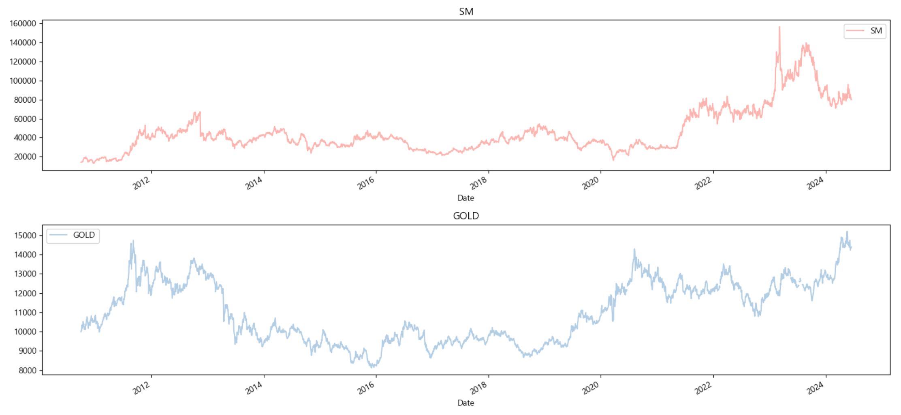

<br></br>

- 차분 후 데이터를 확인하였을 때, SM, GLD 수익률의 변동이 전반적으로 크지 않기 때문에 일반적으로 안정적이라 판단되나  
  2023년 sm의 수익률이 크게 변동한 것으로 나타나 해당 연도에 안정성이 떨어진 것으로 보여진다.

<br>


<br></br>
<br></br>

### 3. 변화율 및 변동률
- SM과 GLD의 변화율 및 변동률을 비교한 결과, SM의 변화율과 변동률이 상대적으로 높게 나타났다.
- 2023년 SM의 수익률 변동이 크게 발생한 점을 고려할 때, 단기적인 변동이 장기적인 안정성을 올바르게 반영하지 못할 가능성이 있다.

<br>

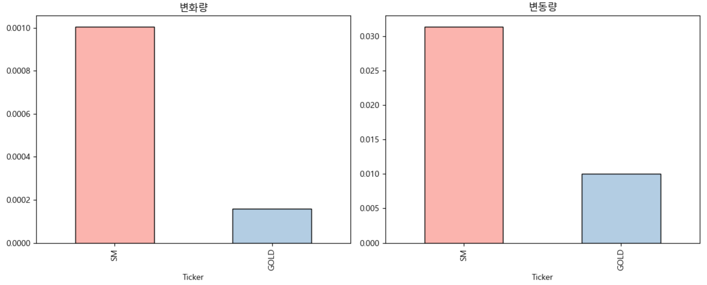

<br></br>
<br></br>

### 4. VIF
- SM과 GLD의 다중공선성을 확인하여 두 종목 간의 상관관계를 평가한 결과, 각 VIF 점수가 약 1로 나타나며 매우 낮은 상관관계를 보였다.  
- 따라서 주가 변동 패턴이 유사하다고 해서 두 종목 간에 상관관계가 있다고 단정할 수 없었고, 각 종목은 서로 독립적이며 선형 관계가 거의 없음을 확인했다.

<br>

| feature | vif_score |
|:-------:|:---------:|
| SM      | 1.000015  |
| GLD     | 1.000015  |

<br></br>
<br></br>

### 6. 분포
- 데이터 분포와 로그 변환된 데이터 분포를 비교하엿을 때, 정규분포에 가까워진 것을 확인할 수 있다.
- 이로 인해 신뢰성이 향상되었으며, 로그 변환을 통해 일정한 척도로 비교할 수 있는 편의성이 증가했다. 

<br>

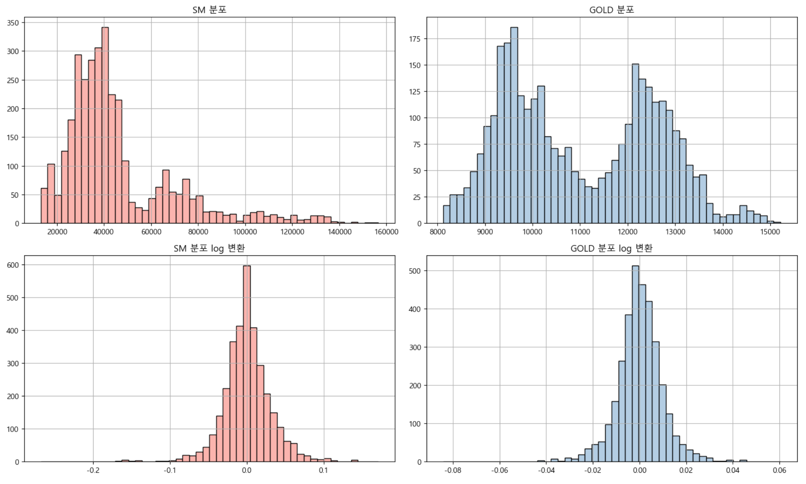

<br></br>
<br></br>

### 5. 수익률
- 현재 시점에서 과거의 시점을 기준으로 SM과 GLD의 수익률을 계산하고 시각화했다.
- SM과 GLD의 연율화된 연간 수익률을 비교하였을 때, SM이 25.84%, GLD가 4.78%로 SM의 수익율이 더 높다는 것을 확인했다.
- 하지만, SM의 수익율이 높은 대신 변동률은 GLD가 더 안정적이므로  
  고수익을 원하는 투자자는 SM을 선호할 수 있지만, 안정적인 투자를 원하는 경우에는 GLD를 선택할 수 있다.

<br>

| 종목  | 수익률       |
|:---:|:---------:|
| SM  | 0.259264  |
| GLD | 0.047449  |

<br>


<br></br>

#### ○ 일간 수익률
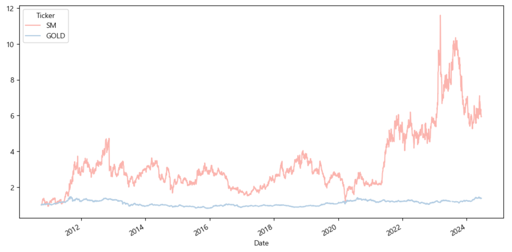

<br></br>

#### ○ 월간 수익률
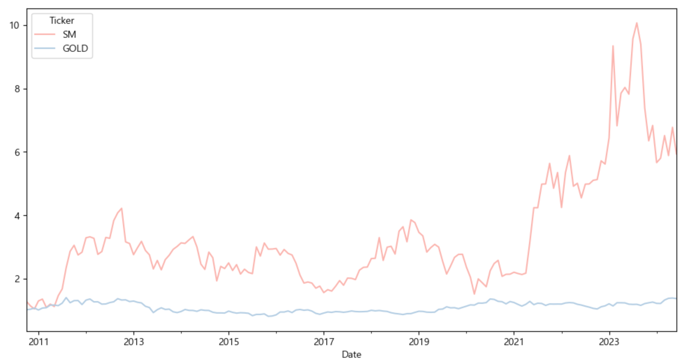

<br>

- SM의 일간 수익률과 연간 수익률은 2011년 말과 2022년에 변동성이 크게 나타났지만, GLD는 안정적인 패턴을 보였다,
- 월간 수익률은 각 월의 마지막 값을 기준으로 측정되었으며, 월간 수익률 그래프는 일간 수익률 그래프보다 변동성이 적고 더 안정적이다.

<br>

**○ 2011년**
- 2011년 하반기: 그룹 EXO의 데뷔로 인해 수익률이 크게 상승했다.


<br>

**○ 2021년**
- 5월: 그룹 NCT DREAM의 활동으로 인해 수익률이 크게 상승했다.
- 9월: 그룹 NCT 127의 선주문량 및 판매량이 최다 기록을 세우며 수익률 변동성이 크게 나타났다.

<div>
    
    
</div>

<br>

**○ 2023년**
- 2023년 상반기: 그룹 NCT 127의 음반 판매 및 월드투어 개최 성공으로 수익률이 크게 성장했다.

<div>
    
    
</div>

- 2023년 하반기: 그룹 라이즈의 멤버 홍승한 군의 사생활 논란으로 인하여 수익률이 크게 하락했다.


<br>

**○ 2024년**
- 2024년 상반기: 그룹 에스파의 멤버 카리나 양의 연애설로 인해 수익률이 크게 하락했다.

<br>

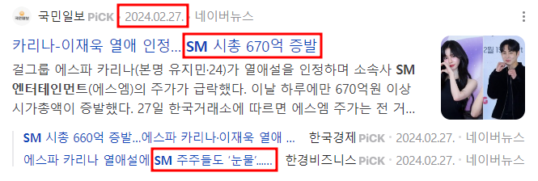

<br></br>
<br></br>

### 6. 이동평균
- SM 종목의 20일 이동평균 주가 움직임을 확인하였을 때, 최댓값과 최솟값이 감소하는 상황이며, 주가 상승과 하락도 극단적으로 줄어들고 있다.
- 따라서, 최댓값과 최솟값의 감소는 전반적으로 추가가 하락하고 있는 추세를 나타낸다.

<br>

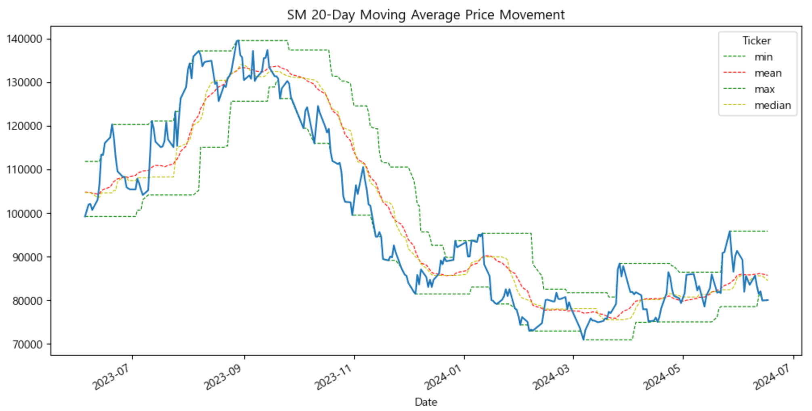

<br></br>
<br></br>

### 7. 거래 전략
- 장기 선과 단기 선을 표시하여 골든/데드 크로스를 나타냈다.
- 변화 폭이 가장 컸던 2023년 상반기는 장기가 상승하고 단기가 하락함에 따라 골든 크로스가 발생해 적극 매수가 권장됐고,  
  이후 2023년 하반기에 장기가 하락하고 단기가 상승함에 따라 데드 크로스가 발생해 적극 매도가 권장됐다.

<br>

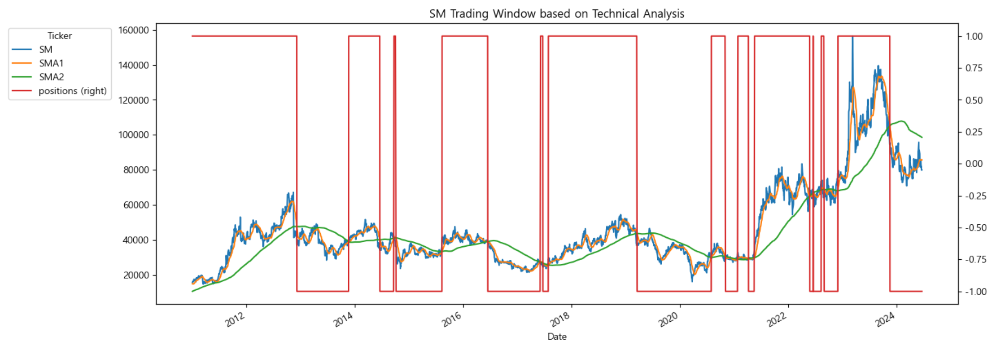

<br></br>
<br></br>
<br></br>

## Ⅱ. 머신러닝
### 1. 데이터 세트 분리
- 모델 평가를 위해 전체 데이터의 80%를 훈련 데이터로 나머지 20%를 평가 데이터로 분리했다.

<br>

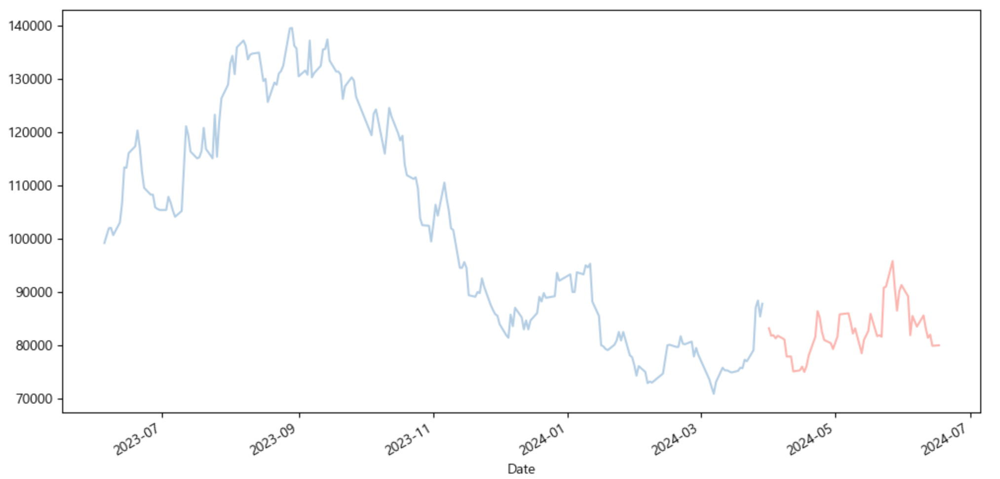

<br></br>
<br></br>

### 2. ACF, PACF
- 좌측 ACF 그래프는 점차 감소하는 상관관계를 보이며, 느리게 감소함에 따라 비정상성을 띄고 있음을 확인할 수 있다.
- 차분 후 우측 PACF 그래프를 시각화하여 정상성을 가지고 있는 것을 확인할 수 있으며, 이는 AR(자기회귀) 모델을 적용하기에 적합하다.

<br>


<br></br>
<br></br>

### 3. 검정
- 검정을 통해 1차분이 가장 좋은 것으로 나타났으며, 오토 아리마를 통해 최적의 파라미터 값을 도출했다.
- ARIMA(0,1,0)이 최적의 모델로 나타났다.

<br>

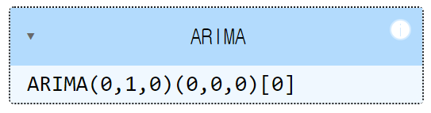

<br></br>
<br></br>

### 4. 모델 정보
- Prob(Q), 융-박스 검정 통계량 수치가 0.58로 나타났고,  
  코렐로그램에서도 0 주변에 안착(정상 시계열) 했기 때문에 잔차가 독립적이라고 보여진다.  
    따라서 시계열 데이터에서의 자기상관 구조가 없어 보인다.
  
- Prob(H), 이분산성 검정 통계량 수치가 0.00으로 나타났고,  
  스탠다다이즈드 레지듀얼스에서 잔차의 분산이 일정하지 않음에 따라 이분산성이 있다고 보여진다.
  
- Prob(JB), 자크-베라 검정 통계량 수치가 0.00으로 나타났고,  
  노멀 큐-큐에서 잔차가 45도 선상에 분포되어 있지 않기 때문에 정규분포를 따르지 않는다고 보여진다.
  
- Skew, 왜도 수치는 0.62으로 나타났고 Kurtosis, 첨도 수치는 6.30으로 나타났다.  
  히스토그램에서 종목인 KDE가 정규분포인 N보다 조금 더 우측으로 쏠리고 뾰족한 것으로 보여진다.

<br>

<div>
  
  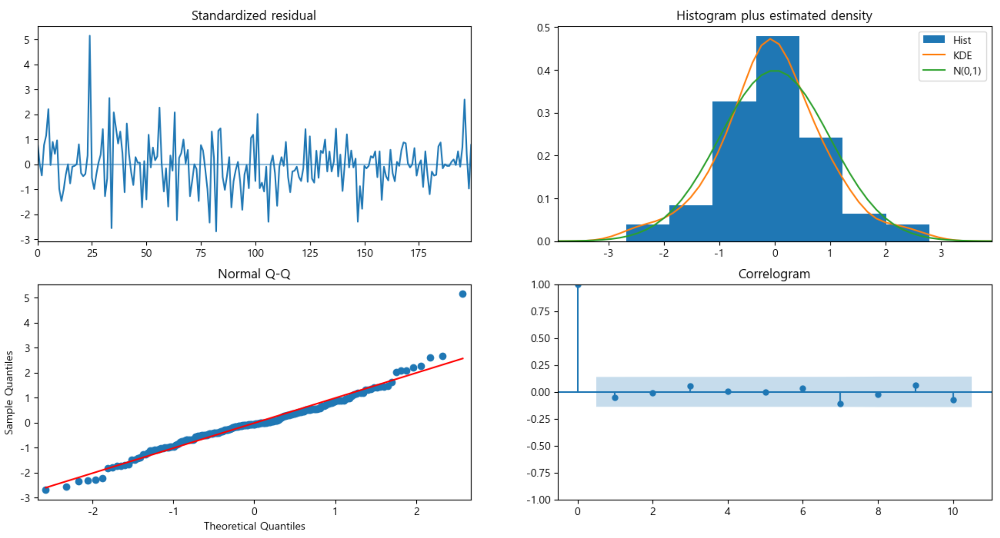
</div>

<br></br>
<br></br>

### 5. 예측
#### ○ 미업데이트
- y_test 길이만큼의 기간 동안의 예측을 수행 시  
  주어진 입력 데이터의 패턴 및 동향을 고려하여 값을 예상하는데,  
  모델이 현재 사용 중인 데이터에 대해서만 학습하기 때문에 동일한 값만 나타나고 있다.
- 따라서, 모델 업데이트를 해야만 추가적인 예측이 제대로 수행된다.

<br>

| 연번  | 예측값      |
|:---:|:--------:|
| 201 | 87800.0  |
| 202 | 87800.0  |
| ... | ...      |
| 250 | 87800.0  |
| 251 | 87800.0  |

<br></br>

#### ○ 업데이트
- 신뢰구간: 81748.25615207, 93851.74384793
- 신뢰구간은 예측값의 범위를 나타내며, 이 범위 내에 새로운 데이터가 포함되면 모델의 예측이 일치한다고 간주된다.
- 신뢰구간의 중심에 있는 값(평균값)을 예측값으로 사용하여 모델의 예측을 보다 신뢰성 있게 수행한다.

<br>

| Date       | test    | 예측값      |
|:----------:|:-------:|:--------:|
| 2024-04-01 | 83200.0 | 87800.0  |
| 2024-04-02 | 81800.0 | 83200.0  |
| ...        | ...     | ...      |
| 2024-06-14 | 79900.0 | 82000.0  |
| 2024-06-17 | 80000.0 | 79900.0  |

<br></br>

- 실제 값을 알고 있어야 예측이 되기 때문에 한 스텝 씩 업데이트를 하여 예측한 결과  
  2.6879% 센트의 오차가 있으나 시각화 자료를 확인하였을 때, 거의 유사한 것을 알 수 있었다.
- 시계열 데이터는 실제 데이터와 모델의 예측 값을 비교하여 모델의 평가를 위해 사용되는 것으로 미래이의 값을 예측하기는 어렵다.  
  따라서 딥러닝에서 미래를 예측해보기로 한다.

<br>


<br></br>
<br></br>
<br></br>

## Ⅲ. 딥러닝
### 1. 1cycle
```
'changepoint_prior_scale': [0.05, 0.1, 0.5, 1.0, 5.0, 10.0],
'seasonality_prior_scale': [0.05, 0.1, 1.0, 10.0],
'seasonality_mode': ['additive', 'multiplicative']
```

<br>

- 위 파라미터 값과 1년치 데이터를 통해 프로팻으로 최적의 파라미터 값을 탐색한 결과 로스 값 약 0.0842으로 나오는,  
  changepoint_prior_scale=0.10,  
  seasonality_prior_scale=0.10,  
  seasonality_mode='additive'이 가장 최적의 파라미터로 나타났다.

<br>

| changepoint_prior_scale | seasonality_prior_scale | seasonality_mode | mape     |
|:-----------------------:|:-----------------------:|:----------------:|:--------:|
| 0.10                    | 0.10                    | additive         | 0.0842 |

<br></br>

- 예측 결과 신뢰 구간이 뒤로 갈수록 점점 넓어지는 것을 확인할 수 있었으며,  
  훈련 값이 신뢰 구간에서 조금씩 벗어나는 것으로 보여졌다.
- 따라서, 1년치 데이터로는 정확한 예측이 불가능하다고 판단되어 3년치 데이터로 예측을 시도해보기로 한다.

<br>


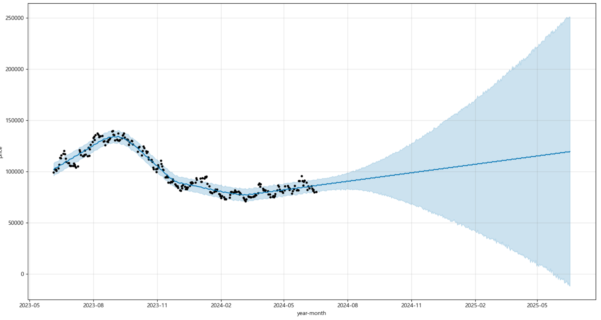

<br></br>

#### ○ 연간 그래프
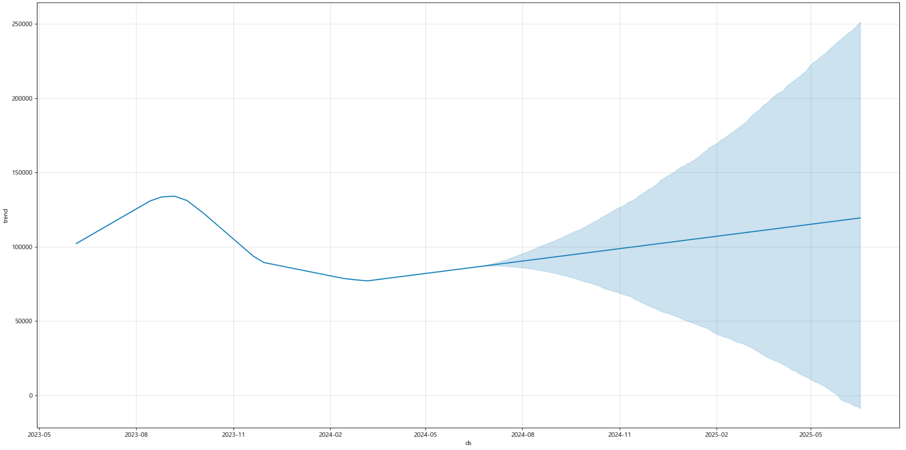

<br></br>

#### ○ 주간 그래프


- 연간 그래프를 보았을 때 2023년 11월 쯤 주가가 크게 하락하는데, 그룹 라이즈의 멤버 홍승한 군의 사생활 논란과 맞물린다.
- 이후 점차 소폭 상승하는 추세를 보인다.

<br>


<br>

- 주간 그래프 확인 시 월요일에 많이 하락하며 수요일에 많이 상승하는 것을 알 수 있었다.

<br></br>
<br></br>

### 2. 2cycle
```
'changepoint_prior_scale': [0.05, 0.1, 0.5, 1.0, 5.0, 10.0],
'seasonality_prior_scale': [0.05, 0.1, 1.0, 10.0],
'seasonality_mode': ['additive', 'multiplicative']
```

<br>

- 위 파라미터 값과 3년치 데이터를 통해 최적의 파라미터 값을 탐색한 결과 로스 값 약 0.1911으로 나오는  
  changepoint_prior_scale=5.00,  
  seasonality_prior_scale=0.05,  
  seasonality_mode='multiplicative'이 가장 최적의 파라미터로 나타났으나,  
  multiplicative의 주기성을 더 주려고 하는 특성으로 아래와 같은 그래프가 그려지게 됐다.

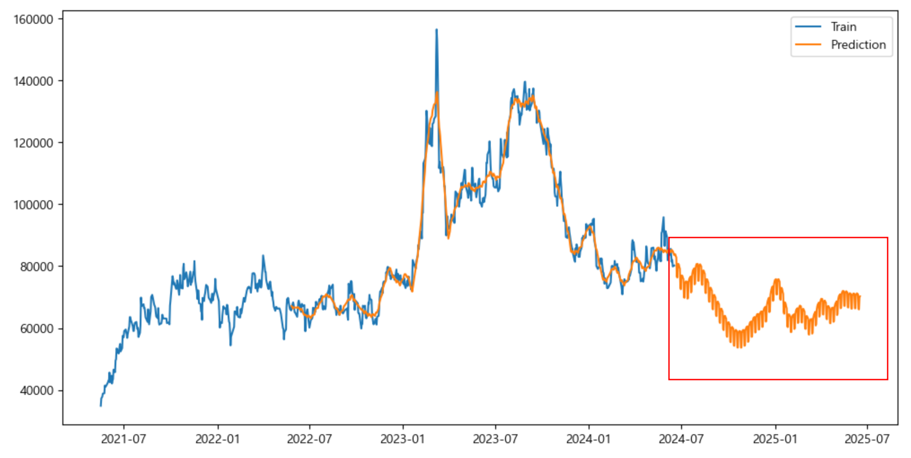

<br>

- 따라서, 기존 파라미터 값에 모드만 'additive'로 변경하여 사용하고자 한다.

<br>

| changepoint_prior_scale | seasonality_prior_scale | seasonality_mode | mape     |
|:-----------------------:|:-----------------------:|:----------------:|:--------:|
| 5.00                    | 0.05                    | additive         | 0.1909 |

<br></br>

- 예측 결과 신뢰 구간이 뒤로 갈수록 점점 넓어지는 것을 확인할 수 있었으며,  
  훈련 값이 신뢰 구간과 거의 유사한 것으로 보여졌다.

<br>

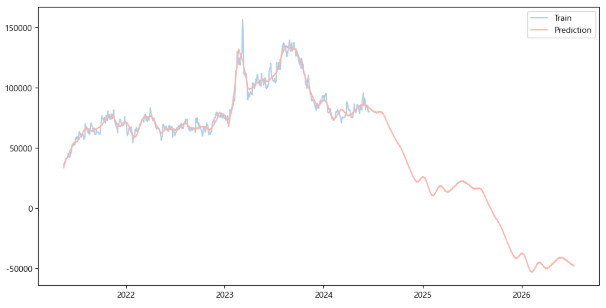


<br></br>

#### ○ 연간 그래프
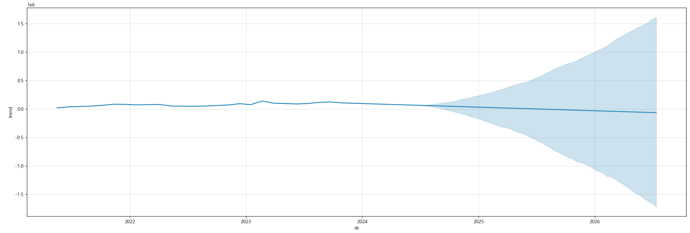

<br></br>

#### ○ 주간 그래프
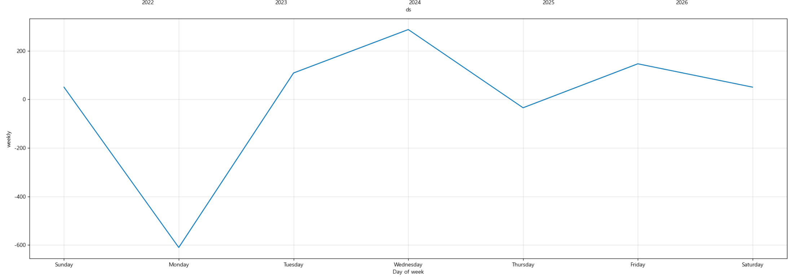

<br></br>

#### ○ 월간 그래프


<br>

- 연간 그래프를 보았을 때 거의 일정하게 나오지만 소폭 하락하는 추세가 보여진다.
- 주간 그래프 확인 시 월요일에 많이 하락하며 수요일에 많이 상승하는 것을 알 수 있었다.
- 월간 그래프 확인 시 2월과 11월에 많이 하락하고 5월부터 8월까지 상승하는 추세가 보여진다.